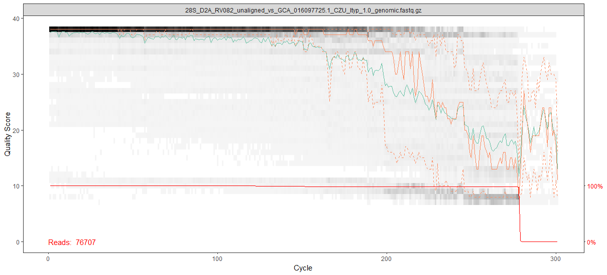

# Reanalysis of V. Rau <i>Ips typographus</i> / nematode 18S and 28S metabarcoding dataset

Veronica Rau originally generated a dataset of 18S and 28S metabarcoding reads as part of a project to investigate, primarily, the diversity of nematodes associated with <i>Ipy typographus</i> in the S. Tyrol region using molecular methods, as previous identification has been done via morphology only.

D2A and D3B primers were used to target the 28S region: ACAAGTACCGTGAGGGAAAGTTG + TCGGAAGGAACCAGCTACTA
NEM (forward and reverse) primers were used to target the 18S region: GCAAGTCTGGTGCCAGCAGC + CCGTGTTGAGTCAAATTAAG

These primers were chosen as they target the nematode 18 and 28S regions. However, excluding reads aligning to the host <i>I. typographus</i> genome, >25% of reads were classified to nematoda via BLASTP search, and <50% in any given sample. This left many reads unassigned.

We are interested to know what other species are represented in the dataset amongst the non-nematoda, non-Ips reads. Maja Fluch investigated further by using the BOLD (Barcode Of Life Data Systems) database to assign identity to the reads as an alternative approach to BLASTP against the NCBI nt database (Veronica's method). However, the results of this analysis remain confusing as many taxa are assigned that seem biologically implausible.

My aim is the draw out some clearer patterns from the data - if possible. Below are documented analysis and commands used with this dataset. All commands were executed on the ScientificNet HPC Cluster accessed at the University of Bozen-Bolzano from the directory /data/users/theaven/nematode_project, unless stated otherwise.

## Contents

1. [Collecting Data](#2)
2. [Read Quality Control and ASV Inference](#3)
  2.1 [FastQC](#7)
  2.2 [Cutadapt](#8)
  2.3 [Fastp](#9)
  2.4 [Bowtie2](#10)
  2.5 [DADA2](#11)
3. [Placeholder](#4)
4. [Placeholder](#5)
5. [Placeholder](#6)


Because systematic errors often appear at low counts: Drop ASVs that: Occur in only one sample, and Are below a minimal count or relative abundance threshold (e.g. <10 reads or <0.1% of sample reads). Or require ASVs to be present in ≥2 samples to be retained. This is a blunt tool (you can throw away real rare things), but in practice it helps a lot for error pruning.


3.Apply minimum-abundance / prevalence filters

4.Classify ASVs with Kraken2 (or BLAST)

5.Remove ASVs classified outside expected taxa

Kraken2/Bracken with a SILVA-based database. Kraken2 uses exact k-mer matches against a database - closest to BOLD. Taxonomic precision depends strongly on database quality, works better with large databases of thousands of reads/ASVs.

SILVA SSU and LSU - BLAST locally
SILVA ACT - SILVA’s ACT service allows you to upload your own sequences and have them aligned, taxonomically classified, and placed into a reference phylogenetic tree. This is the official and recommended way to classify your 18S/28S sequences using SILVA. You do not need to submit sequences to the SILVA database itself; you simply upload them to the ACT tool for annotation. For large numbers of sequences, ACT can be slow; a local BLAST or alignment against SILVA may be faster. SILVA releases can be downloaded from the SILVA site (including pre-formatted QIIME2/DADA2 training sets

BOLD - Boldigger - k-mer / distance-based matching - its own alignment and similarity scoring (optimized for COI) - BIN system (Barcode Index Number clusters—computed with algorithms not based on BLAST)

If you need high-throughput classification, many researchers use:
QIIME2 + SILVA classifier. QIIME2 is a naive Bayes classifier - Learns k-mer frequency patterns. Handles short, conserved sequences better than BLAST and is better for assigning ambiguous reads, handling subtle variations in conserved regions, and avoiding overconfident species matches. Gives probability-based taxonomic assignments. Train a classifier on SILVA/PR2 trimmed to your primer region. Run qiime feature-classifier classify-sklearn. Get per-ASV taxonomy (up to genus/species, if present in the DB). QIIME2 Naïve Bayes needs a database trimmed to your exact primer region.

VSEARCH/BLAST + SILVA fasta. VSEARCH / BLAST against SILVA/PR2 (very common)

SINA aligner (SILVA’s standalone alignment tool)

IDTAXA (DECIPHER package in R) - probabilistic sequence classification, model-based learning - usually more accurate and conservative than BLAST or naive Bayes. IDTAXA does not require trimming and handles full-length sequences correctly. IDTAXA is slower than QIIME2 NB, but usually much more accurate for 18S/28S metabarcoding.

BLAST is alignment based, limited by 'best hit' interpretation, and prone to misidentifying short or conserved seqeunces. For eDNA/metabarcoding, BLAST is often too literal — it finds the closest sequence, even if it’s wrong.

NemaBase - “nematode-optimized” subset of 18S rRNA reference sequences. Source: all nematode 18S sequences from SILVA (v111 and v138). Curation: cleaning up taxonomy (standardizing taxonomic ranks, updating according to accepted nematode classification, removing suspicious or erroneous entries) to produce a cleaner, well-annotated dataset. Best for soil, freshwater or terrestrial nematode communities where sequenced nematodes are common in SILVA and common metabarcoding primers are used.

Charrier et al. 2024 rRNA-cistron 18S DB - Four databases; 18S, 28S, ITS-1, and ITS-1-5.8S-ITS-2. Curation: Built with the markerDB pipeline (systematic mining and filtering of GenBank) and deduplicated to full-length representatives. Has maximum species coverage across Nematoda. Best for wildlife parasites, marine/free-living nematodes, or very broad community surveys where phylum-wide coverage matters.

NemaTaxa - Built explicitly from sequences that match the NF1 / 18Sr2b primer pair (the standard soil nematode metabarcoding marker). Source: Nematode 18S sequences pulled from NCBI + SILVA v132. Curation: Manual trimming of taxonomy to classical Linnaean ranks (kingdom → genus). Missing ranks filled manually; inconsistent strings cleaned. Good for the the NF1 / 18Sr2b primer pair soil/agricultural metabarcoding. Very clean taxonomy strings suitable for QIIME2.

## Collecting data <a name="2"></a>
Raw sequencing reads were retreived from the archive folder \\share.unibz.it\AppliedMolecularEntomologyLab\ips_typographus\nematode_metabarcoding and uploaded to the HPC:
```bash
ls /data/users/theaven/nematode_project/raw_data/18S
ls /data/users/theaven/nematode_project/raw_data/28S

for file in $(ls /data/users/theaven/nematode_project/raw_data/*/*.fastq.gz); do
ID=$(basename $file | rev | cut -d '_' -f2- | rev)
mkdir $(dirname $file)/$ID
mv $file $(dirname $file)/$ID/.
done
```

## Read Quality Control and ASV Inference <a name="3"></a>

#### FastQC  <a name="7"></a>
The raw sequence reads were subjected to a quality control check using FastQC.
```bash
screen -S nematode
module load anaconda3
for ReadDir in $(ls -d /data/users/theaven/nematode_project/raw_data/*S/*); do
	Task=FastQC
	ID=$(echo "$ReadDir" | cut -d '/' -f7,8 | sed 's@/@_@g')
    Reads=("$ReadDir"/*.fastq.gz)
	OutDir="$ReadDir"/"$Task"
	ExpectedOutput="$OutDir"/$(basename "${Reads[0]}" | sed 's@.fastq.gz@@g')_fastqc.html

	Jobs=$(squeue -h -u theaven -n "$Task" | wc -l)
	while [ "$Jobs" -gt 9 ]; do
		sleep 5s
		printf "."
		Jobs=$(squeue -h -u theaven -n "$Task" | wc -l)
	done

	if [ ! -s "$ExpectedOutput" ]; then
		jobid=$(sbatch --job-name="$Task" --parsable ~/git_repos/Wrappers/unibz/run_fastqc.sh "$OutDir" "${Reads[@]}")
		printf "%s\t%s\t "$Task" \t%s\n" "$(date -Iseconds)" "$ID" "$jobid" >> /home/clusterusers/theaven/slurm_log.tsv
	else
		echo "For $ID found: $ExpectedOutput" 
	fi
done
```
#### Cutadapt  <a name="8"></a>
Primers were removed from the reads where present using Cutadapt.

NOTE:The reads are a mix of paired and single end samples.
```bash
screen -r nematode
for ReadDir in $(ls -d /data/users/theaven/nematode_project/raw_data/28S/*); do
	Task=CutAdapt
	ID=$(echo "$ReadDir" | cut -d '/' -f7,8 | sed 's@/@_@g')
    Reads=("$ReadDir"/*.fastq.gz)
	OutDir="$(echo "$ReadDir" | sed 's@raw_data@qc_data@g')/"$Task""
	Forward_Primer=ACAAGTACCGTGAGGGAAAGTTG
	Reverse_Primer=TCGGAAGGAACCAGCTACTA
	ExpectedOutput="$OutDir"/$(basename "${Reads[0]}" | sed 's@.fastq.gz@.trim.fastq.gz@g')

	Jobs=$(squeue -h -u theaven -n "$Task" | wc -l)
	while [ "$Jobs" -gt 9 ]; do
		sleep 5s
		printf "."
		Jobs=$(squeue -h -u theaven -n "$Task" | wc -l)
	done

	if [ ! -s "$ExpectedOutput" ]; then
		jobid=$(sbatch --job-name="$Task" --parsable ~/git_repos/Wrappers/unibz/run_cutadapt.sh "$OutDir" "$Forward_Primer" "$Reverse_Primer" "${Reads[@]}")
		printf "%s\t%s\t "$Task" \t%s\n" "$(date -Iseconds)" "$ID" "$jobid" >> /home/clusterusers/theaven/slurm_log.tsv
	else
		echo "For $ID found: $ExpectedOutput" 
	fi
done

for ReadDir in $(ls -d /data/users/theaven/nematode_project/raw_data/18S/*); do
	Task=CutAdapt
	ID=$(echo "$ReadDir" | cut -d '/' -f7,8 | sed 's@/@_@g')
    Reads=("$ReadDir"/*.fastq.gz)
	OutDir="$(echo "$ReadDir" | sed 's@raw_data@qc_data@g')/"$Task""
	Forward_Primer=GCAAGTCTGGTGCCAGCAGC
	Reverse_Primer=CCGTGTTGAGTCAAATTAAG
	ExpectedOutput="$OutDir"/$(basename "${Reads[0]}" | sed 's@.fastq.gz@.trim.fastq.gz@g')

	Jobs=$(squeue -h -u theaven -n "$Task" | wc -l)
	while [ "$Jobs" -gt 9 ]; do
		sleep 5s
		printf "."
		Jobs=$(squeue -h -u theaven -n "$Task" | wc -l)
	done

	if [ ! -s "$ExpectedOutput" ]; then
		jobid=$(sbatch --job-name="$Task" --parsable ~/git_repos/Wrappers/unibz/run_cutadapt.sh "$OutDir" "$Forward_Primer" "$Reverse_Primer" "${Reads[@]}")
		printf "%s\t%s\t "$Task" \t%s\n" "$(date -Iseconds)" "$ID" "$jobid" >> /home/clusterusers/theaven/slurm_log.tsv
	else
		echo "For $ID found: $ExpectedOutput" 
	fi
done
```
#### Fastp  <a name="9"></a>

Reads were trimmed with Fastp to remove adapters, reads/pairs shorter than 100bp or with >40% of bases below phred 20 were discarded.
```bash
screen -r nematode
for ReadDir in $(ls -d /data/users/theaven/nematode_project/qc_data/*S/*/CutAdapt); do
	Task=Fastp
	ID=$(echo "$ReadDir" | cut -d '/' -f7,8 | sed 's@/@_@g')
    Reads=("$ReadDir"/*.fastq.gz)
	OutDir="$(dirname "$ReadDir")/"$Task""
	ExpectedOutput="$OutDir"/$(basename "${Reads[0]}" | sed 's@.fastq.gz@.trimmed.fastq.gz@g')

	Jobs=$(squeue -h -u theaven -n "$Task" | wc -l)
	while [ "$Jobs" -gt 9 ]; do
		sleep 60s
		printf "."
		Jobs=$(squeue -h -u theaven -n "$Task" | wc -l)
	done

	if [ ! -s "$ExpectedOutput" ]; then
		jobid=$(sbatch --job-name="$Task" --parsable ~/git_repos/Wrappers/unibz/run_fastp.sh "$OutDir" "${Reads[@]}")
		printf "%s\t%s\t "$Task" \t%s\n" "$(date -Iseconds)" "$ID" "$jobid" >> /home/clusterusers/theaven/slurm_log.tsv
	else
		echo "For $ID found: $ExpectedOutput" 
	fi
done
```
#### Bowtie2  <a name="10"></a>

Reads were aligned to the reference <i>I. typographus</i> genome in order to exclude reads from the host.
```bash
screen -r nematode
srun -p cpu  -c 4 --mem 16G --pty bash
module load anaconda3 
conda activate bowtie2
cd ~/genomes/Ips/typographus/GCA_016097725.1
bowtie2-build --threads 4 GCA_016097725.1_CZU_Ityp_1.0_genomic.fna GCA_016097725.1_CZU_Ityp_1.0_genomic_index
exit()

for ReadDir in $(ls -d /data/users/theaven/nematode_project/qc_data/*S/*/Fastp); do
	Task=Bowtie2
	ID=$(echo "$ReadDir" | cut -d '/' -f7,8 | sed 's@/@_@g')
    Reads=("$ReadDir"/*.fastq.gz)
	OutDir="$(dirname "$ReadDir")/"$Task""
	Reference=~/genomes/Ips/typographus/GCA_016097725.1/GCA_016097725.1_CZU_Ityp_1.0_genomic_index
	ExpectedOutput="${OutDir}"/"${ID}"_vs_"$(basename $Reference | sed 's@_index@@g')"_mapped.bam

	Jobs=$(squeue -h -u theaven -n "$Task" | wc -l)
	while [ "$Jobs" -gt 9 ]; do
		sleep 300s
		printf "."
		Jobs=$(squeue -h -u theaven -n "$Task" | wc -l)
	done

	if [ ! -s "$ExpectedOutput" ]; then
		jobid=$(sbatch --job-name="$Task" --parsable ~/git_repos/Wrappers/unibz/run_bowtie2.sh "$OutDir" "$ID" "$Reference" "${Reads[@]}")
		printf "%s\t%s\t "$Task" \t%s\n" "$(date -Iseconds)" "$ID" "$jobid" >> /home/clusterusers/theaven/slurm_log.tsv
	else
		echo "For $ID found: $ExpectedOutput" 
	fi
done

#Remove intermediates:
rm -r /data/users/theaven/nematode_project/qc_data/*S/*/CutAdapt
rm /data/users/theaven/nematode_project/qc_data/*S/*/Fastp/*.fastq.gz
```
#### DADA2  <a name="11"></a>
The denoiser tool DADA2 was run to model and remove error patterns from the Illumina data: read ends where quality drops were trimmed, reads with high expected error (EE), or above a max EE threshold, or with any ambiguous bases (N) were discarded. DADA2’s removeBimeraDenovo function was also used to remove chimera from the ASV table. For paired reads DADA2 also merges forward and reverse reads in the overlapping region. When F and R disagree, the merge algorithm uses quality scores to pick the most likely base or discards the read. The output of DADA2 is an Alternative Sequence Variant (ASV) table as well as filtered denoised read fastq files.

DADA2 is an R package, 18S and 28S, paired and single end reads must be run seperately. The relavent files were downloaded:
```bash
for Dir in $(ls -d /data/users/theaven/nematode_project/qc_data/*S/*/Bowtie2); do
    if ls "$Dir"/*.1.fastq.gz 1> /dev/null 2>&1 && ls "$Dir"/*.2.fastq.gz 1> /dev/null 2>&1; then
        Out=/data/users/theaven/download_18122025/$(echo "$Dir" | cut -d '/' -f7)/paired/$(echo "$Dir" | cut -d '/' -f8)
        mkdir -p "$Out"
        cp "$Dir"/*unaligned*.fastq.gz "$Out"/.
    else
        Out=/data/users/theaven/download_18122025/$(echo "$Dir" | cut -d '/' -f7)/single/$(echo "$Dir" | cut -d '/' -f8)
        mkdir -p "$Out"
        cp "$Dir"/*unaligned*.fastq.gz "$Out"/.
    fi
done
```
"/data/users/theaven/download_18122025" was subseqeuntly downloaded to "C:\Users\THeaven\OneDrive - Scientific Network South Tyrol\R"

<u>Plot reads and select appropriate truncation lengths</u> 

DADA2 quality profile plots summarise per-cycle base quality scores across reads. The solid orange line is median quality score at each base position, the solid turquoise line is mean quality score at each position, orange dashed lines show 10th and 90th percentiles. Q20 = ~1% error rate. Q30 = ~ 0.1% error rate.

DADA2 filter settings will truncate reads, a parameter is required below which length the read is discarded entirely. Plots of read quality help to determine a reasonable cuttoff, ie. before major dropoff in quality of many reads, or the median read quality is < Q25-30, or the lower percentile < Q20, mean and median should also be similar. However, shorter, more permissive lengths are prefered as other filter settings should act as a safety net to remove problem reads. However, for paired reads the truncated forward and reverse reads must still be long enough to overlap (at least 20bp) given the amplicon size or the reads cannot be merged.
```R
if (!require("BiocManager", quietly = TRUE))
    install.packages("BiocManager")
BiocManager::install(c("dada2","ShortRead", "Biostrings"))
install.packages("dplyr")

library(dada2)
library(ShortRead)
library(Biostrings)
library(dplyr)

setwd("C:/Users/THeaven/OneDrive - Scientific Network South Tyrol/R")
set.seed(1)

#18S
#Single end example reads plotted:
plotQualityProfile("download_18122025/18S/single/NEM_ST2_8/18S_NEM_ST2_8_unaligned_vs_GCA_016097725.1_CZU_Ityp_1.0_genomic.fastq.gz") #30-180 
plotQualityProfile("download_18122025/18S/single/NEM_ST2_9/18S_NEM_ST2_9_unaligned_vs_GCA_016097725.1_CZU_Ityp_1.0_genomic.fastq.gz") #110-200-250 
plotQualityProfile("download_18122025/18S/single/NEM_RV061/18S_NEM_RV061_unaligned_vs_GCA_016097725.1_CZU_Ityp_1.0_genomic.fastq.gz") #140-225-275 
plotQualityProfile("download_18122025/18S/single/NEM_RV062/18S_NEM_RV062_unaligned_vs_GCA_016097725.1_CZU_Ityp_1.0_genomic.fastq.gz") #140-225-275 
plotQualityProfile("download_18122025/18S/single/NEM_RV106/18S_NEM_RV106_unaligned_vs_GCA_016097725.1_CZU_Ityp_1.0_genomic.fastq.gz") #175-260-275 

#28S
#Single end example reads plotted:
plotQualityProfile("download_18122025/28S/single/D2A_RV061/28S_D2A_RV061_unaligned_vs_GCA_016097725.1_CZU_Ityp_1.0_genomic.fastq.gz") #175-220-250 
plotQualityProfile("download_18122025/28S/single/D2A_RV062/28S_D2A_RV062_unaligned_vs_GCA_016097725.1_CZU_Ityp_1.0_genomic.fastq.gz") #160-220-250 
plotQualityProfile("download_18122025/28S/single/D2A_ST2_8/28S_D2A_ST2_8_unaligned_vs_GCA_016097725.1_CZU_Ityp_1.0_genomic.fastq.gz") #160-160-200 
plotQualityProfile("download_18122025/28S/single/D2A_ST2_9/28S_D2A_ST2_9_unaligned_vs_GCA_016097725.1_CZU_Ityp_1.0_genomic.fastq.gz") #175-200-225 
plotQualityProfile("download_18122025/28S/single/D2A_RV082/28S_D2A_RV082_unaligned_vs_GCA_016097725.1_CZU_Ityp_1.0_genomic.fastq.gz") #175-200-250 

#Paired end example reads plotted:
plotQualityProfile("download_18122025/28S/paired/RV224/28S_RV224_unaligned_vs_GCA_016097725.1_CZU_Ityp_1.0_genomic.1.fastq.gz") #200-250-275 
plotQualityProfile("download_18122025/28S/paired/RV224/28S_RV224_unaligned_vs_GCA_016097725.1_CZU_Ityp_1.0_genomic.2.fastq.gz") #140-190-210 

plotQualityProfile("download_18122025/28S/paired/RV129/28S_RV129_unaligned_vs_GCA_016097725.1_CZU_Ityp_1.0_genomic.1.fastq.gz") #median starts to decline ~200-260-275 
plotQualityProfile("download_18122025/28S/paired/RV129/28S_RV129_unaligned_vs_GCA_016097725.1_CZU_Ityp_1.0_genomic.2.fastq.gz") #140-190-200 

plotQualityProfile("download_18122025/28S/paired/RU1_1/28S_RU1_1_unaligned_vs_GCA_016097725.1_CZU_Ityp_1.0_genomic.1.fastq.gz") #220-260-275 
plotQualityProfile("download_18122025/28S/paired/RU1_1/28S_RU1_1_unaligned_vs_GCA_016097725.1_CZU_Ityp_1.0_genomic.2.fastq.gz") #150-90-220 

plotQualityProfile("download_18122025/28S/paired/CR1_9/28S_CR1_9_unaligned_vs_GCA_016097725.1_CZU_Ityp_1.0_genomic.1.fastq.gz") #190-260-275 
plotQualityProfile("download_18122025/28S/paired/CR1_9/28S_CR1_9_unaligned_vs_GCA_016097725.1_CZU_Ityp_1.0_genomic.2.fastq.gz") #150-190-210 

plotQualityProfile("download_18122025/28S/paired/Ab1_10/28S_Ab1_10_unaligned_vs_GCA_016097725.1_CZU_Ityp_1.0_genomic.1.fastq.gz") #200-260-275 
plotQualityProfile("download_18122025/28S/paired/Ab1_10/28S_Ab1_10_unaligned_vs_GCA_016097725.1_CZU_Ityp_1.0_genomic.2.fastq.gz") #140-190-210 
```
The mean (turquoise) is noticably lower than the median (orange), this indicates that the quality distribution is skewed: many reads are decent (keeping the median high), but a subset of reads are really bad (dragging the mean down). maxEE is the primary setting to target these problem reads.



<u>Collect inputs to run DADA2:</u>
```R
single_18S <- list.files(path = "download_18122025/18S/single", full.names = TRUE, recursive = TRUE)
single_28S <- list.files(path = "download_18122025/28S/single", full.names = TRUE, recursive = TRUE)
paired_28S <- list.files(path = "download_18122025/28S/paired", full.names = TRUE, recursive = TRUE)

single_18S_1 <- single_18S[!grepl("\\.[12]\\.fastq\\.gz$", single_18S)]
single_28S_1 <- single_28S[!grepl("\\.[12]\\.fastq\\.gz$", single_28S)]
paired_28S_1 <- paired_28S[grepl("\\.1\\.fastq.gz$", paired_28S)]
paired_28S_2 <- paired_28S[grepl("\\.2\\.fastq.gz$", paired_28S)]

get_samplename <- function(x) sub("_unaligned_.*$", "", basename(x))

single_18S_lookup_table <- data.frame(
  sample = sapply(single_18S_1, get_samplename),
  fn = single_18S_1,
  stringsAsFactors = FALSE
)

single_28S_lookup_table <- data.frame(
  sample = sapply(single_28S_1, get_samplename),
  fn = single_28S_1,
  stringsAsFactors = FALSE
)

snF <- vapply(paired_28S_1, get_samplename, character(1))
snR <- vapply(paired_28S_2, get_samplename, character(1))
paired_samples <- intersect(snF, snR)
paired_28S_lookup_table <- data.frame(
  sample = paired_samples,
  fnF = paired_28S_1[match(paired_samples, snF)],
  fnR = paired_28S_2[match(paired_samples, snR)],
  stringsAsFactors = FALSE
)
```
<u>Run DADA2 for the different datasets</u>

Run DADA2 for 18S single end reads
```R
#Parameters
truncLen <- 110  #Truncate reads to this length, then remove entirely
truncQ <- 20     #Truncate at first base with quality <= truncQ (higher = more conservative | lower = more permissive)
maxEE <- 1       #Maximum expected errors (1 is strict, 2 is moderate stringency, higher = more sensitivity + more errors tolerated)
maxN <- 0        #Maximum allowed N bases
rm.phix <- TRUE  #Remove PhiX reads (bacteriophage used as control in Illumina sequencing runs)
pool <- FALSE    #Pool samples for error rate estimation (FALSE = error model is learned per sample, this is more conservative and faster/less memory | pseudo = max sensitivity)
threads <- TRUE  #Use multithreading
outdir <- "download_18122025/results/single_18S_dada2_output"
in_df <- single_18S_lookup_table

#Create output directory
dir.create(outdir, showWarnings = FALSE, recursive = TRUE)

#Filter and trim reads
filt_paths <- file.path(outdir, paste0(in_df$sample, "_filt.fastq.gz"))
out <- filterAndTrim(fwd = in_df$fn, filt = filt_paths, truncLen = truncLen, maxN = maxN, maxEE = maxEE, truncQ = truncQ, rm.phix = rm.phix, compress = TRUE, multithread = threads)

#Learn error rates, dereplicate, and run DADA2 algorithm
err <- learnErrors(filt_paths, nbases = 5e10, multithread = threads)
derep <- derepFastq(filt_paths, verbose = TRUE)
names(derep) <- in_df$sample
dada_out <- dada(derep, err = err, pool = pool, multithread = threads)

#Make ASV table and remove chimeras
seqtab <- makeSequenceTable(dada_out)
seqtab.nochim <- removeBimeraDenovo(seqtab, method = "consensus", multithread = threads, verbose = TRUE)
nonchim_reads <- rowSums(seqtab.nochim)
chim_reads    <- rowSums(seqtab) - nonchim_reads
chim_track <- cbind(nonchim = nonchim_reads, chimera = chim_reads, chimera_fraction = chim_reads / rowSums(seqtab))


#Save results
saveRDS(seqtab.nochim, file = file.path(outdir, "seqtab.nochim.rds"))
write.table(seqtab.nochim, file.path(outdir, "seqtab.nochim.tsv"), sep="\t", quote=FALSE, col.names=NA)

getN <- function(x) sum(getUniques(x))
track <- cbind(input = out[, "reads.in"], filtered = out[, "reads.out"], denoised = sapply(dada_out, getN))
rownames(track) <- in_df$sample
write.table(track, file.path(outdir, "read_tracking.tsv"), sep="\t", quote=FALSE, col.names=NA)

write.table(chim_track, file.path(outdir, "chimera_tracking.tsv"), sep="\t", quote=FALSE, col.names=NA)
```
Run DADA2 for 28S single end reads
```R
#Parameters
truncLen <- 160  #Truncate reads to this length, then remove entirely
truncQ <- 20     #Truncate at first base with quality <= truncQ (higher = more conservative | lower = more permissive)
maxEE <- 1       #Maximum expected errors (1 is strict, 2 is moderate stringency, higher = more sensitivity + more errors tolerated)
maxN <- 0        #Maximum allowed N bases
rm.phix <- TRUE  #Remove PhiX reads (bacteriophage used as control in Illumina sequencing runs)
pool <- FALSE    #Pool samples for error rate estimation (FALSE = error model is learned per sample, this is more conservative and faster/less memory | pseudo = max sensitivity)
threads <- TRUE  #Use multithreading
outdir <- "download_18122025/results/single_28S_dada2_output"
in_df <- single_28S_lookup_table

#Create output directory
dir.create(outdir, showWarnings = FALSE, recursive = TRUE)

#Filter and trim reads
filt_paths <- file.path(outdir, paste0(in_df$sample, "_filt.fastq.gz"))
out <- filterAndTrim(fwd = in_df$fn, filt = filt_paths, truncLen = truncLen, maxN = maxN, maxEE = maxEE, truncQ = truncQ, rm.phix = rm.phix, compress = TRUE, multithread = threads)

#Learn error rates, dereplicate, and run DADA2 algorithm
err <- learnErrors(filt_paths, nbases = 5e10, multithread = threads)
derep <- derepFastq(filt_paths, verbose = TRUE)
names(derep) <- in_df$sample
dada_out <- dada(derep, err = err, pool = pool, multithread = threads)

#Make ASV table and remove chimeras
seqtab <- makeSequenceTable(dada_out)
seqtab.nochim <- removeBimeraDenovo(seqtab, method = "consensus", multithread = threads, verbose = TRUE)
nonchim_reads <- rowSums(seqtab.nochim)
chim_reads    <- rowSums(seqtab) - nonchim_reads
chim_track <- cbind(nonchim = nonchim_reads, chimera = chim_reads, chimera_fraction = chim_reads / rowSums(seqtab))


#Save results
saveRDS(seqtab.nochim, file = file.path(outdir, "seqtab.nochim.rds"))
write.table(seqtab.nochim, file.path(outdir, "seqtab.nochim.tsv"), sep="\t", quote=FALSE, col.names=NA)

getN <- function(x) sum(getUniques(x))
track <- cbind(input = out[, "reads.in"], filtered = out[, "reads.out"], denoised = sapply(dada_out, getN))
rownames(track) <- in_df$sample
write.table(track, file.path(outdir, "read_tracking.tsv"), sep="\t", quote=FALSE, col.names=NA)

write.table(chim_track, file.path(outdir, "chimera_tracking.tsv"), sep="\t", quote=FALSE, col.names=NA)
```
Run DADA2 for paired end reads
```R
#Parameters
truncLen <- c(190, 140)  #Truncate reads to this length, then remove entirely
truncQ <- 20     #Truncate at first base with quality <= truncQ (higher = more conservative | lower = more permissive)
maxEE <- c(1,3)  #Maximum expected errors (4 for the reverse reads as these are known/expected to be lower quality)
maxN <- 0        #Maximum allowed N bases
rm.phix <- TRUE  #Remove PhiX reads (bacteriophage used as control in Illumina sequencing runs)
pool <- FALSE    #Pool samples for error rate estimation (FALSE = error model is learned per sample, this is more conservative and faster/less memory | pseudo = max sensitivity)
threads <- TRUE  #Use multithreading
outdir <- "download_18122025/results/paired_28S_dada2_output"
in_df <- paired_28S_lookup_table

#Create output directory
dir.create(outdir, showWarnings = FALSE, recursive = TRUE)

#Filter and trim reads (paired)
filtFs <- file.path(outdir, paste0(in_df$sample, "_F_filt.fastq.gz"))
filtRs <- file.path(outdir, paste0(in_df$sample, "_R_filt.fastq.gz"))
out <- filterAndTrim(fwd = in_df$fnF, filt = filtFs, rev = in_df$fnR, filt.rev = filtRs, truncLen = truncLen, maxN = maxN, maxEE = maxEE, truncQ = truncQ, rm.phix = rm.phix, compress = TRUE, multithread = threads)

#Learn error rates, dereplicate, run DADA2 algorithm, and merge pairs
#Learn errors separately for F and R
errF <- learnErrors(filtFs, nbases = 5e10, multithread = threads)
errR <- learnErrors(filtRs, nbases = 5e10, multithread = threads)
#Derep separately
derepF <- derepFastq(filtFs, verbose = TRUE)
derepR <- derepFastq(filtRs, verbose = TRUE)
names(derepF) <- in_df$sample
names(derepR) <- in_df$sample
#Denoise separately
dadaF <- dada(derepF, err = errF, pool = pool, multithread = threads)
dadaR <- dada(derepR, err = errR, pool = pool, multithread = threads)
#Merge pairs
mergers <- mergePairs(dadaF, derepF, dadaR, derepR, verbose = TRUE)

#Make ASV table and remove chimeras
seqtab <- makeSequenceTable(mergers)
seqtab.nochim <- removeBimeraDenovo(seqtab, method = "consensus", multithread = threads, verbose = TRUE)
nonchim_reads <- rowSums(seqtab.nochim)
chim_reads    <- rowSums(seqtab) - nonchim_reads
chim_track <- cbind(nonchim = nonchim_reads, chimera = chim_reads, chimera_fraction = chim_reads / rowSums(seqtab))

# Save results
saveRDS(seqtab.nochim, file = file.path(outdir, "seqtab.nochim.rds"))
write.table(seqtab.nochim, file.path(outdir, "seqtab.nochim.tsv"), sep="\t", quote=FALSE, col.names=NA)

getN <- function(x) sum(getUniques(x))
track <- cbind(input    = out[, "reads.in"], filtered = out[, "reads.out"], denoisedF = sapply(dadaF, getN), denoisedR = sapply(dadaR, getN), merged = sapply(mergers, function(x) sum(x$abundance)))
rownames(track) <- in_df$sample
write.table(track, file.path(outdir, "read_tracking.tsv"), sep="\t", quote=FALSE, col.names=NA)

write.table(chim_track, file.path(outdir, "chimera_tracking.tsv"), sep="\t", quote=FALSE, col.names=NA)
```
Very few read pairs could be merged successfully, even when very permissive filtering settings were trialled (truncQ = 1, maxEE = 2,4, truncLen = 100,100), this is likely because the reads generated from Illumina sequencing are 300bp in length and the 28S amplicon is expected to be 580-650bp depending on the species, this leaves no margin for trimming of primers and lower quality bases, indeed in most cases even with no trimming at all paired reads will not have the 20bp minimum overlap required for merging.

The higher quality forward reads from the 28S paired data were combined with the single end 28S reads to produce a combined dataset.
```R
combined_28S_lookup_table <- bind_rows(single_28S_lookup_table %>% select(sample, fn), paired_28S_lookup_table %>% select(sample, fn = fnF))

#Parameters
truncLen <- 160  #Truncate reads to this length, then remove entirely
truncQ <- 20     #Truncate at first base with quality <= truncQ (higher = more conservative | lower = more permissive)
maxEE <- 1       #Maximum expected errors (1 is strict, 2 is moderate stringency, higher = more sensitivity + more errors tolerated)
maxN <- 0        #Maximum allowed N bases
rm.phix <- TRUE  #Remove PhiX reads (bacteriophage used as control in Illumina sequencing runs)
pool <- FALSE    #Pool samples for error rate estimation (FALSE = error model is learned per sample, this is more conservative and faster/less memory | pseudo = max sensitivity)
threads <- TRUE  #Use multithreading
outdir <- "download_18122025/results/combined_28S_dada2_output"
in_df <- combined_28S_lookup_table

#Create output directory
dir.create(outdir, showWarnings = FALSE, recursive = TRUE)

#Filter and trim reads
filt_paths <- file.path(outdir, paste0(in_df$sample, "_filt.fastq.gz"))
out <- filterAndTrim(fwd = in_df$fn, filt = filt_paths, truncLen = truncLen, maxN = maxN, maxEE = maxEE, truncQ = truncQ, rm.phix = rm.phix, compress = TRUE, multithread = threads)

#Learn error rates, dereplicate, and run DADA2 algorithm
err <- learnErrors(filt_paths, nbases = 5e10, multithread = threads)
derep <- derepFastq(filt_paths, verbose = TRUE)
names(derep) <- in_df$sample
dada_out <- dada(derep, err = err, pool = pool, multithread = threads)

#Make ASV table and remove chimeras
seqtab <- makeSequenceTable(dada_out)
seqtab.nochim <- removeBimeraDenovo(seqtab, method = "consensus", multithread = threads, verbose = TRUE)
nonchim_reads <- rowSums(seqtab.nochim)
chim_reads    <- rowSums(seqtab) - nonchim_reads
chim_track <- cbind(nonchim = nonchim_reads, chimera = chim_reads, chimera_fraction = chim_reads / rowSums(seqtab))


#Save results
saveRDS(seqtab.nochim, file = file.path(outdir, "seqtab.nochim.rds"))
write.table(seqtab.nochim, file.path(outdir, "seqtab.nochim.tsv"), sep="\t", quote=FALSE, col.names=NA)

getN <- function(x) sum(getUniques(x))
track <- cbind(input = out[, "reads.in"], filtered = out[, "reads.out"], denoised = sapply(dada_out, getN))
rownames(track) <- in_df$sample
write.table(track, file.path(outdir, "read_tracking.tsv"), sep="\t", quote=FALSE, col.names=NA)

write.table(chim_track, file.path(outdir, "chimera_tracking.tsv"), sep="\t", quote=FALSE, col.names=NA)
```
## Placeholder <a name="4"></a>


## Placeholder <a name="5"></a>

## Placeholder <a name="6"></a>
