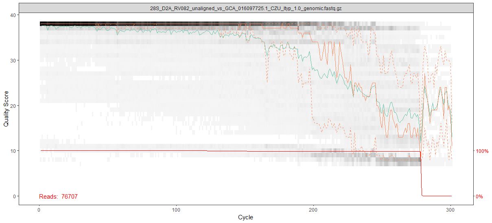

# Reanalysis of V. Rau <i>Ips typographus</i> / nematode 18S and 28S metabarcoding dataset

Veronica Rau originally generated a dataset of 18S and 28S metabarcoding reads as part of a project to investigate, primarily, the diversity of nematodes associated with <i>Ipy typographus</i> in the S. Tyrol region using molecular methods, as previous identification has been done via morphology only.

D2A and D3B primers were used to target the 28S region: ACAAGTACCGTGAGGGAAAGTTG + TCGGAAGGAACCAGCTACTA
NEM (forward and reverse) primers were used to target the 18S region: GCAAGTCTGGTGCCAGCAGC + CCGTGTTGAGTCAAATTAAG

These primers were chosen as they target the nematode 18 and 28S regions. However, excluding reads aligning to the host <i>I. typographus</i> genome, >25% of reads were classified to nematoda via BLASTP search, and <50% in any given sample. This left many reads unassigned.

We are interested to know what other species are represented in the dataset amongst the non-nematoda, non-Ips reads. Maja Fluch investigated further by using the BOLD (Barcode Of Life Data Systems) database to assign identity to the reads as an alternative approach to BLASTP against the NCBI nt database (Veronica's method). However, the results of this analysis remain confusing as many taxa are assigned that seem biologically implausible.

My aim is the draw out some clearer patterns from the data - if possible. Below are documented analysis and commands used with this dataset. All commands were executed on the ScientificNet HPC Cluster accessed at the University of Bozen-Bolzano from the directory /data/users/theaven/nematode_project, unless stated otherwise.

## Contents

1. [Collecting Data](#2)
2. [Quality Control and ASV Inference](#3)
  2.1 [FastQC](#7)
  2.2 [Cutadapt](#8)
  2.3 [Fastp](#9)
  2.4 [Bowtie2](#10)
  2.5 [DADA2](#11)
  2.6 [Minimum-abundance / prevalence filtering](#12)
3. [Taxonomy Assignment - QIIME2](#6)
  3.1 [QIIME2](#17)
  3.2 [QIIME2 Custom](#18)
4. [Taxonomy Assignment - IDTAXA](#4)
  4.1 [QIIME2](#15)
  4.2 [IDTAXA](#16)
  4.3 [IDTAXA Custom](#19)
5. [Taxonomy Assignment - BLASTN](#5)
  5.1 [BLASTN](#14)
  5.2 [NCBI nt](#20)
  5.3 [SILVA SSU and LSU - BLAST locally / ACT lookup](#21)
6. [Taxonomy Assignment - BOLD](#22)
7. [Nematode Curated Databases](#23)
  7.1 [IDTAXA - nemabiome](#24)
  7.2 [IDTAXA - nemabase](#25)
8. [Relate my ASVs to Veronika/Maja's reads](#26)

## Collecting data <a name="2"></a>
Raw sequencing reads were retreived from the archive folder \\share.unibz.it\AppliedMolecularEntomologyLab\ips_typographus\nematode_metabarcoding and uploaded to the HPC:
```bash
ls /data/users/theaven/nematode_project/raw_data/18S
ls /data/users/theaven/nematode_project/raw_data/28S

for file in $(ls /data/users/theaven/nematode_project/raw_data/*/*.fastq.gz); do
ID=$(basename $file | rev | cut -d '_' -f2- | rev)
mkdir $(dirname $file)/$ID
mv $file $(dirname $file)/$ID/.
done
```

## Quality Control and ASV Inference <a name="3"></a>

### FastQC  <a name="7"></a>
The raw sequence reads were subjected to a quality control check using FastQC.
```bash
for ReadDir in /data/users/theaven/nematode_project/raw_data/*S/*; do
    ID=$(basename "$ReadDir")
    echo "$ID"
    zcat "$ReadDir"/*1.fastq.gz | wc -l | awk '{print $1/4}'
    zcat "$ReadDir"/*2.fastq.gz | wc -l | awk '{print $1/4}'
done

screen -S nematode
module load anaconda3
for ReadDir in $(ls -d /data/users/theaven/nematode_project/raw_data/*S/*); do
	Task=FastQC
	ID=$(echo "$ReadDir" | cut -d '/' -f7,8 | sed 's@/@_@g')
    Reads=("$ReadDir"/*.fastq.gz)
	OutDir="$ReadDir"/"$Task"
	ExpectedOutput="$OutDir"/$(basename "${Reads[0]}" | sed 's@.fastq.gz@@g')_fastqc.html

	Jobs=$(squeue -h -u theaven -n "$Task" | wc -l)
	while [ "$Jobs" -gt 9 ]; do
		sleep 5s
		printf "."
		Jobs=$(squeue -h -u theaven -n "$Task" | wc -l)
	done

	if [ ! -s "$ExpectedOutput" ]; then
		jobid=$(sbatch --job-name="$Task" --parsable ~/git_repos/Wrappers/unibz/run_fastqc.sh "$OutDir" "${Reads[@]}")
		printf "%s\t%s\t "$Task" \t%s\n" "$(date -Iseconds)" "$ID" "$jobid" >> /home/clusterusers/theaven/slurm_log.tsv
	else
		echo "For $ID found: $ExpectedOutput" 
	fi
done
```
### Cutadapt  <a name="8"></a>
Primers were removed from the reads where present using Cutadapt.

NOTE:The reads are a mix of paired and single end samples.
```bash
screen -r nematode
for ReadDir in $(ls -d /data/users/theaven/nematode_project/raw_data/28S/*); do
	Task=CutAdapt
	ID=$(echo "$ReadDir" | cut -d '/' -f7,8 | sed 's@/@_@g')
    Reads=("$ReadDir"/*.fastq.gz)
	OutDir="$(echo "$ReadDir" | sed 's@raw_data@qc_data@g')/"$Task""
	Forward_Primer=ACAAGTACCGTGAGGGAAAGTTG
	Reverse_Primer=TCGGAAGGAACCAGCTACTA
	ExpectedOutput="$OutDir"/$(basename "${Reads[0]}" | sed 's@.fastq.gz@.trim.fastq.gz@g')

	Jobs=$(squeue -h -u theaven -n "$Task" | wc -l)
	while [ "$Jobs" -gt 9 ]; do
		sleep 5s
		printf "."
		Jobs=$(squeue -h -u theaven -n "$Task" | wc -l)
	done

	if [ ! -s "$ExpectedOutput" ]; then
		jobid=$(sbatch --job-name="$Task" --parsable ~/git_repos/Wrappers/unibz/run_cutadapt.sh "$OutDir" "$Forward_Primer" "$Reverse_Primer" "${Reads[@]}")
		printf "%s\t%s\t "$Task" \t%s\n" "$(date -Iseconds)" "$ID" "$jobid" >> /home/clusterusers/theaven/slurm_log.tsv
	else
		echo "For $ID found: $ExpectedOutput" 
	fi
done

for ReadDir in $(ls -d /data/users/theaven/nematode_project/raw_data/18S/*); do
	Task=CutAdapt
	ID=$(echo "$ReadDir" | cut -d '/' -f7,8 | sed 's@/@_@g')
    Reads=("$ReadDir"/*.fastq.gz)
	OutDir="$(echo "$ReadDir" | sed 's@raw_data@qc_data@g')/"$Task""
	echo "$OutDir"
	Forward_Primer=GCAAGTCTGGTGCCAGCAGC
	Reverse_Primer=CCGTGTTGAGTCAAATTAAG
	ExpectedOutput="$OutDir"/$(basename "${Reads[0]}" | sed 's@.fastq.gz@.trim.fastq.gz@g')

	Jobs=$(squeue -h -u theaven -n "$Task" | wc -l)
	while [ "$Jobs" -gt 9 ]; do
		sleep 5s
		printf "."
		Jobs=$(squeue -h -u theaven -n "$Task" | wc -l)
	done

	if [ ! -s "$ExpectedOutput" ]; then
		jobid=$(sbatch --job-name="$Task" --parsable ~/git_repos/Wrappers/unibz/run_cutadapt.sh "$OutDir" "$Forward_Primer" "$Reverse_Primer" "${Reads[@]}")
		printf "%s\t%s\t "$Task" \t%s\n" "$(date -Iseconds)" "$ID" "$jobid" >> /home/clusterusers/theaven/slurm_log.tsv
	else
		echo "For $ID found: $ExpectedOutput" 
	fi
done

for ReadDir in /data/users/theaven/nematode_project/qc_data/*/*/CutAdapt; do
    ID=$(echo "$ReadDir" | cut -d '/' -f7,8 | sed 's@/@_@g')
    echo "$ID" >> post_cutadapt_count.txt
    zcat "$ReadDir"/*1.trim.fastq.gz | wc -l | awk '{print $1/4}' >> post_cutadapt_count.txt
    zcat "$ReadDir"/*2.trim.fastq.gz | wc -l | awk '{print $1/4}' >> post_cutadapt_count.txt
done
```
### Fastp  <a name="9"></a>

Reads were trimmed with Fastp to remove adapters, reads/pairs shorter than 100bp or with >40% of bases below phred 20 were discarded.
```bash
screen -r nematode
for ReadDir in $(ls -d /data/users/theaven/nematode_project/qc_data/*S/*/CutAdapt); do
	Task=Fastp
	ID=$(echo "$ReadDir" | cut -d '/' -f7,8 | sed 's@/@_@g')
    Reads=("$ReadDir"/*.fastq.gz)
	OutDir="$(dirname "$ReadDir")/"$Task""
	ExpectedOutput="$OutDir"/$(basename "${Reads[0]}" | sed 's@.fastq.gz@.trimmed.fastq.gz@g')

	Jobs=$(squeue -h -u theaven -n "$Task" | wc -l)
	while [ "$Jobs" -gt 9 ]; do
		sleep 60s
		printf "."
		Jobs=$(squeue -h -u theaven -n "$Task" | wc -l)
	done

	if [ ! -s "$ExpectedOutput" ]; then
		jobid=$(sbatch --job-name="$Task" --parsable ~/git_repos/Wrappers/unibz/run_fastp.sh "$OutDir" "${Reads[@]}")
		printf "%s\t%s\t "$Task" \t%s\n" "$(date -Iseconds)" "$ID" "$jobid" >> /home/clusterusers/theaven/slurm_log.tsv
	else
		echo "For $ID found: $ExpectedOutput" 
	fi
done

for ReadDir in /data/users/theaven/nematode_project/qc_data/*/*/Fastp; do
    ID=$(echo "$ReadDir" | cut -d '/' -f7,8 | sed 's@/@_@g')
    echo "$ID" >> post_fastp_count.txt
    zcat "$ReadDir"/*1.trim.trimmed.fastq.gz | wc -l | awk '{print $1/4}' >> post_fastp_count.txt
    zcat "$ReadDir"/*2.trim.trimmed.fastq.gz | wc -l | awk '{print $1/4}' >> post_fastp_count.txt
done

#For 28S samples 10s of thousands of reads are retained after fastp, for 18S there are some samples where read count is reduced below 10,000 (still >3,000). I will continue with fastp filtered reads as this step was performed by V. Rau.
```
### Bowtie2  <a name="10"></a>

Reads were aligned to the reference <i>I. typographus</i> genome in order to exclude reads from the host.
```bash
screen -r nematode
srun -p cpu  -c 4 --mem 16G --pty bash
module load anaconda3 
conda activate bowtie2
cd ~/genomes/Ips/typographus/GCA_016097725.1
bowtie2-build --threads 4 GCA_016097725.1_CZU_Ityp_1.0_genomic.fna GCA_016097725.1_CZU_Ityp_1.0_genomic_index
exit()

for ReadDir in $(ls -d /data/users/theaven/nematode_project/qc_data/*S/*/Fastp); do
	Task=Bowtie2
	ID=$(echo "$ReadDir" | cut -d '/' -f7,8 | sed 's@/@_@g')
    Reads=("$ReadDir"/*.fastq.gz)
	OutDir="$(dirname "$ReadDir")/"$Task""
	Reference=~/genomes/Ips/typographus/GCA_016097725.1/GCA_016097725.1_CZU_Ityp_1.0_genomic_index
	ExpectedOutput="${OutDir}"/"${ID}"_vs_"$(basename $Reference | sed 's@_index@@g')"_mapped.bam

	Jobs=$(squeue -h -u theaven -n "$Task" | wc -l)
	while [ "$Jobs" -gt 9 ]; do
		sleep 300s
		printf "."
		Jobs=$(squeue -h -u theaven -n "$Task" | wc -l)
	done

	if [ ! -s "$ExpectedOutput" ]; then
		jobid=$(sbatch --job-name="$Task" --parsable ~/git_repos/Wrappers/unibz/run_bowtie2.sh "$OutDir" "$ID" "$Reference" "${Reads[@]}")
		printf "%s\t%s\t "$Task" \t%s\n" "$(date -Iseconds)" "$ID" "$jobid" >> /home/clusterusers/theaven/slurm_log.tsv
	else
		echo "For $ID found: $ExpectedOutput" 
	fi
done

#Remove intermediates:
rm -r /data/users/theaven/nematode_project/qc_data/*S/*/CutAdapt
rm /data/users/theaven/nematode_project/qc_data/*S/*/Fastp/*.fastq.gz
```
### DADA2  <a name="11"></a>
The denoiser tool DADA2 was run to model and remove error patterns from the Illumina data: read ends where quality drops were trimmed, reads with high expected error (EE), or above a max EE threshold, or with any ambiguous bases (N) were discarded. DADA2’s removeBimeraDenovo function was also used to remove chimera from the ASV table. For paired reads DADA2 also merges forward and reverse reads in the overlapping region. When F and R disagree, the merge algorithm uses quality scores to pick the most likely base or discards the read. The output of DADA2 is an Alternative Sequence Variant (ASV) table as well as filtered denoised read fastq files.

DADA2 is an R package, 18S and 28S, paired and single end reads must be run seperately. The relavent files were downloaded:
```bash
for Dir in $(ls -d /data/users/theaven/nematode_project/qc_data/*S/*/Bowtie2); do
    if ls "$Dir"/*.1.fastq.gz 1> /dev/null 2>&1 && ls "$Dir"/*.2.fastq.gz 1> /dev/null 2>&1; then
        Out=/data/users/theaven/download_18122025/$(echo "$Dir" | cut -d '/' -f7)/paired/$(echo "$Dir" | cut -d '/' -f8)
        mkdir -p "$Out"
        cp "$Dir"/*unaligned*.fastq.gz "$Out"/.
    else
        Out=/data/users/theaven/download_18122025/$(echo "$Dir" | cut -d '/' -f7)/single/$(echo "$Dir" | cut -d '/' -f8)
        mkdir -p "$Out"
        cp "$Dir"/*unaligned*.fastq.gz "$Out"/.
    fi
done
```
"/data/users/theaven/download_18122025" was subseqeuntly downloaded to "C:\Users\THeaven\OneDrive - Scientific Network South Tyrol\R"

**Plot reads and select appropriate truncation lengths:**

DADA2 filter settings will truncate reads, a parameter is required below which length the read is discarded entirely. Plots of read quality help to determine a reasonable cuttoff, ie. before major dropoff in quality of many reads, or the median read quality is < Q25-30, or the lower percentile < Q20, mean and median should also be similar. However, shorter, more permissive lengths are prefered as other filter settings should act as a safety net to remove problem reads. However, for paired reads the truncated forward and reverse reads must still be long enough to overlap (at least 20bp) given the amplicon size or the reads cannot be merged.
```R
if (!require("BiocManager", quietly = TRUE))
    install.packages("BiocManager")
BiocManager::install(c("dada2","ShortRead", "Biostrings"))
install.packages("dplyr")

library(dada2)
library(ShortRead)
library(Biostrings)
library(dplyr)

setwd("C:/Users/THeaven/OneDrive - Scientific Network South Tyrol/R")
set.seed(1)

#18S
#Single end example reads plotted:
plotQualityProfile("download_18122025/18S/single/NEM_ST2_8/18S_NEM_ST2_8_unaligned_vs_GCA_016097725.1_CZU_Ityp_1.0_genomic.fastq.gz") #30-180 
plotQualityProfile("download_18122025/18S/single/NEM_ST2_9/18S_NEM_ST2_9_unaligned_vs_GCA_016097725.1_CZU_Ityp_1.0_genomic.fastq.gz") #110-200-250 
plotQualityProfile("download_18122025/18S/single/NEM_RV061/18S_NEM_RV061_unaligned_vs_GCA_016097725.1_CZU_Ityp_1.0_genomic.fastq.gz") #140-225-275 
plotQualityProfile("download_18122025/18S/single/NEM_RV062/18S_NEM_RV062_unaligned_vs_GCA_016097725.1_CZU_Ityp_1.0_genomic.fastq.gz") #140-225-275 
plotQualityProfile("download_18122025/18S/single/NEM_RV106/18S_NEM_RV106_unaligned_vs_GCA_016097725.1_CZU_Ityp_1.0_genomic.fastq.gz") #175-260-275 

#28S
#Single end example reads plotted:
plotQualityProfile("download_18122025/28S/single/D2A_RV061/28S_D2A_RV061_unaligned_vs_GCA_016097725.1_CZU_Ityp_1.0_genomic.fastq.gz") #175-220-250 
plotQualityProfile("download_18122025/28S/single/D2A_RV062/28S_D2A_RV062_unaligned_vs_GCA_016097725.1_CZU_Ityp_1.0_genomic.fastq.gz") #160-220-250 
plotQualityProfile("download_18122025/28S/single/D2A_ST2_8/28S_D2A_ST2_8_unaligned_vs_GCA_016097725.1_CZU_Ityp_1.0_genomic.fastq.gz") #160-160-200 
plotQualityProfile("download_18122025/28S/single/D2A_ST2_9/28S_D2A_ST2_9_unaligned_vs_GCA_016097725.1_CZU_Ityp_1.0_genomic.fastq.gz") #175-200-225 
plotQualityProfile("download_18122025/28S/single/D2A_RV082/28S_D2A_RV082_unaligned_vs_GCA_016097725.1_CZU_Ityp_1.0_genomic.fastq.gz") #175-200-250 

#Paired end example reads plotted:
plotQualityProfile("download_18122025/28S/paired/RV224/28S_RV224_unaligned_vs_GCA_016097725.1_CZU_Ityp_1.0_genomic.1.fastq.gz") #200-250-275 
plotQualityProfile("download_18122025/28S/paired/RV224/28S_RV224_unaligned_vs_GCA_016097725.1_CZU_Ityp_1.0_genomic.2.fastq.gz") #140-190-210 

plotQualityProfile("download_18122025/28S/paired/RV129/28S_RV129_unaligned_vs_GCA_016097725.1_CZU_Ityp_1.0_genomic.1.fastq.gz") #median starts to decline ~200-260-275 
plotQualityProfile("download_18122025/28S/paired/RV129/28S_RV129_unaligned_vs_GCA_016097725.1_CZU_Ityp_1.0_genomic.2.fastq.gz") #140-190-200 

plotQualityProfile("download_18122025/28S/paired/RU1_1/28S_RU1_1_unaligned_vs_GCA_016097725.1_CZU_Ityp_1.0_genomic.1.fastq.gz") #220-260-275 
plotQualityProfile("download_18122025/28S/paired/RU1_1/28S_RU1_1_unaligned_vs_GCA_016097725.1_CZU_Ityp_1.0_genomic.2.fastq.gz") #150-90-220 

plotQualityProfile("download_18122025/28S/paired/CR1_9/28S_CR1_9_unaligned_vs_GCA_016097725.1_CZU_Ityp_1.0_genomic.1.fastq.gz") #190-260-275 
plotQualityProfile("download_18122025/28S/paired/CR1_9/28S_CR1_9_unaligned_vs_GCA_016097725.1_CZU_Ityp_1.0_genomic.2.fastq.gz") #150-190-210 

plotQualityProfile("download_18122025/28S/paired/Ab1_10/28S_Ab1_10_unaligned_vs_GCA_016097725.1_CZU_Ityp_1.0_genomic.1.fastq.gz") #200-260-275 
plotQualityProfile("download_18122025/28S/paired/Ab1_10/28S_Ab1_10_unaligned_vs_GCA_016097725.1_CZU_Ityp_1.0_genomic.2.fastq.gz") #140-190-210 
```
DADA2 quality profile plots summarise per-cycle base quality scores across reads. The solid orange line is median quality score at each base position, the solid turquoise line is mean quality score at each position, orange dashed lines show 10th and 90th percentiles. Q20 = ~1% error rate. Q30 = ~ 0.1% error rate.



For subset of samples plotted the mean (turquoise) is frequently noticably lower than the median (orange), this indicates that the quality distribution is skewed: many reads are decent (keeping the median high), but a subset of reads are really bad (dragging the mean down). maxEE is the primary setting to target these problem reads.

**Collect inputs to run DADA2:**
```R
single_18S <- list.files(path = "download_18122025/18S/single", full.names = TRUE, recursive = TRUE)
single_28S <- list.files(path = "download_18122025/28S/single", full.names = TRUE, recursive = TRUE)
paired_28S <- list.files(path = "download_18122025/28S/paired", full.names = TRUE, recursive = TRUE)

single_18S_1 <- single_18S[!grepl("\\.[12]\\.fastq\\.gz$", single_18S)]
single_28S_1 <- single_28S[!grepl("\\.[12]\\.fastq\\.gz$", single_28S)]
paired_28S_1 <- paired_28S[grepl("\\.1\\.fastq.gz$", paired_28S)]
paired_28S_2 <- paired_28S[grepl("\\.2\\.fastq.gz$", paired_28S)]

get_samplename <- function(x) sub("_unaligned_.*$", "", basename(x))

single_18S_lookup_table <- data.frame(
  sample = sapply(single_18S_1, get_samplename),
  fn = single_18S_1,
  stringsAsFactors = FALSE
)

single_28S_lookup_table <- data.frame(
  sample = sapply(single_28S_1, get_samplename),
  fn = single_28S_1,
  stringsAsFactors = FALSE
)

snF <- vapply(paired_28S_1, get_samplename, character(1))
snR <- vapply(paired_28S_2, get_samplename, character(1))
paired_samples <- intersect(snF, snR)
paired_28S_lookup_table <- data.frame(
  sample = paired_samples,
  fnF = paired_28S_1[match(paired_samples, snF)],
  fnR = paired_28S_2[match(paired_samples, snR)],
  stringsAsFactors = FALSE
)
```
**Run DADA2 for the different datasets:**
truncLen was selected based upon where median median base quality score starts to drop in the plotted samples. A stricter maxEE setting was selected to try to filter out problem reads of particularly poor quality.

Run DADA2 for 18S single end reads:
```R
#Parameters
truncLen <- 110  #Truncate reads to this length, below this remove entirely
truncQ <- 20     #Truncate at first base with quality <= truncQ (higher = more conservative | lower = more permissive)
maxEE <- 1       #Maximum expected errors (1 is strict, 2 is moderate stringency, higher = more sensitivity + more errors tolerated)
maxN <- 0        #Maximum allowed N bases
rm.phix <- TRUE  #Remove PhiX reads (bacteriophage used as control in Illumina sequencing runs)
pool <- FALSE    #Pool samples for error rate estimation (FALSE = error model is learned per sample, this is more conservative and faster/less memory | pseudo = max sensitivity)
threads <- TRUE  #Use multithreading
outdir <- "download_18122025/results/single_18S_dada2_output"
in_df <- single_18S_lookup_table

#Create output directory
dir.create(outdir, showWarnings = FALSE, recursive = TRUE)

#Filter and trim reads
filt_paths <- file.path(outdir, paste0(in_df$sample, "_filt.fastq.gz"))
out <- filterAndTrim(fwd = in_df$fn, filt = filt_paths, truncLen = truncLen, maxN = maxN, maxEE = maxEE, truncQ = truncQ, rm.phix = rm.phix, compress = TRUE, multithread = threads)

#Learn error rates, dereplicate, and run DADA2 algorithm
err <- learnErrors(filt_paths, nbases = 5e10, multithread = threads)
derep <- derepFastq(filt_paths, verbose = TRUE)
names(derep) <- in_df$sample
dada_out <- dada(derep, err = err, pool = pool, multithread = threads)

#Make ASV table and remove chimeras
seqtab <- makeSequenceTable(dada_out)
seqtab.nochim <- removeBimeraDenovo(seqtab, method = "consensus", multithread = threads, verbose = TRUE)
nonchim_reads <- rowSums(seqtab.nochim)
chim_reads    <- rowSums(seqtab) - nonchim_reads
chim_track <- cbind(nonchim = nonchim_reads, chimera = chim_reads, chimera_fraction = chim_reads / rowSums(seqtab))


#Save results
saveRDS(seqtab.nochim, file = file.path(outdir, "seqtab.nochim.rds"))
write.table(seqtab.nochim, file.path(outdir, "seqtab.nochim.tsv"), sep="\t", quote=FALSE, col.names=NA)
dim(seqtab.nochim)
#  80 1247

getN <- function(x) sum(getUniques(x))
track <- cbind(input = out[, "reads.in"], filtered = out[, "reads.out"], denoised = sapply(dada_out, getN))
rownames(track) <- in_df$sample
write.table(track, file.path(outdir, "read_tracking.tsv"), sep="\t", quote=FALSE, col.names=NA)

write.table(chim_track, file.path(outdir, "chimera_tracking.tsv"), sep="\t", quote=FALSE, col.names=NA)
```
52.4% of single end 18S reads were retained through filtering and denoising. Of these filtered reads, 0 - 6.7% were subseqeuently identified as chimeric depending on the sample, the median portion of chimeric reads was 1%. 1247 ASVs were inferred.

Run DADA2 for 28S single end reads:
```R
#Parameters
truncLen <- 160  #Truncate reads to this length, then remove entirely
truncQ <- 20     #Truncate at first base with quality <= truncQ (higher = more conservative | lower = more permissive)
maxEE <- 1       #Maximum expected errors (1 is strict, 2 is moderate stringency, higher = more sensitivity + more errors tolerated)
maxN <- 0        #Maximum allowed N bases
rm.phix <- TRUE  #Remove PhiX reads (bacteriophage used as control in Illumina sequencing runs)
pool <- FALSE    #Pool samples for error rate estimation (FALSE = error model is learned per sample, this is more conservative and faster/less memory | pseudo = max sensitivity)
threads <- TRUE  #Use multithreading
outdir <- "download_18122025/results/single_28S_dada2_output"
in_df <- single_28S_lookup_table

#Create output directory
dir.create(outdir, showWarnings = FALSE, recursive = TRUE)

#Filter and trim reads
filt_paths <- file.path(outdir, paste0(in_df$sample, "_filt.fastq.gz"))
out <- filterAndTrim(fwd = in_df$fn, filt = filt_paths, truncLen = truncLen, maxN = maxN, maxEE = maxEE, truncQ = truncQ, rm.phix = rm.phix, compress = TRUE, multithread = threads)

#Learn error rates, dereplicate, and run DADA2 algorithm
err <- learnErrors(filt_paths, nbases = 5e10, multithread = threads)
derep <- derepFastq(filt_paths, verbose = TRUE)
names(derep) <- in_df$sample
dada_out <- dada(derep, err = err, pool = pool, multithread = threads)

#Make ASV table and remove chimeras
seqtab <- makeSequenceTable(dada_out)
seqtab.nochim <- removeBimeraDenovo(seqtab, method = "consensus", multithread = threads, verbose = TRUE)
nonchim_reads <- rowSums(seqtab.nochim)
chim_reads    <- rowSums(seqtab) - nonchim_reads
chim_track <- cbind(nonchim = nonchim_reads, chimera = chim_reads, chimera_fraction = chim_reads / rowSums(seqtab))


#Save results
saveRDS(seqtab.nochim, file = file.path(outdir, "seqtab.nochim.rds"))
write.table(seqtab.nochim, file.path(outdir, "seqtab.nochim.tsv"), sep="\t", quote=FALSE, col.names=NA)

getN <- function(x) sum(getUniques(x))
track <- cbind(input = out[, "reads.in"], filtered = out[, "reads.out"], denoised = sapply(dada_out, getN))
rownames(track) <- in_df$sample
write.table(track, file.path(outdir, "read_tracking.tsv"), sep="\t", quote=FALSE, col.names=NA)

write.table(chim_track, file.path(outdir, "chimera_tracking.tsv"), sep="\t", quote=FALSE, col.names=NA)
```
54.5% of single end 28S reads were retained through filtering and denoising. Of these filtered reads, 0 - 11.6% were subseqeuently identified as chimeric depending on the sample, the median portion of chimeric reads was 3.8%.

Run DADA2 for paired end reads:
```R
#Parameters
truncLen <- c(190, 140)  #Truncate reads to this length, then remove entirely
truncQ <- 20     #Truncate at first base with quality <= truncQ (higher = more conservative | lower = more permissive)
maxEE <- c(1,3)  #Maximum expected errors (4 for the reverse reads as these are known/expected to be lower quality)
maxN <- 0        #Maximum allowed N bases
rm.phix <- TRUE  #Remove PhiX reads (bacteriophage used as control in Illumina sequencing runs)
pool <- FALSE    #Pool samples for error rate estimation (FALSE = error model is learned per sample, this is more conservative and faster/less memory | pseudo = max sensitivity)
threads <- TRUE  #Use multithreading
outdir <- "download_18122025/results/paired_28S_dada2_output"
in_df <- paired_28S_lookup_table

#Create output directory
dir.create(outdir, showWarnings = FALSE, recursive = TRUE)

#Filter and trim reads (paired)
filtFs <- file.path(outdir, paste0(in_df$sample, "_F_filt.fastq.gz"))
filtRs <- file.path(outdir, paste0(in_df$sample, "_R_filt.fastq.gz"))
out <- filterAndTrim(fwd = in_df$fnF, filt = filtFs, rev = in_df$fnR, filt.rev = filtRs, truncLen = truncLen, maxN = maxN, maxEE = maxEE, truncQ = truncQ, rm.phix = rm.phix, compress = TRUE, multithread = threads)

#Learn error rates, dereplicate, run DADA2 algorithm, and merge pairs
#Learn errors separately for F and R
errF <- learnErrors(filtFs, nbases = 5e10, multithread = threads)
errR <- learnErrors(filtRs, nbases = 5e10, multithread = threads)
#Derep separately
derepF <- derepFastq(filtFs, verbose = TRUE)
derepR <- derepFastq(filtRs, verbose = TRUE)
names(derepF) <- in_df$sample
names(derepR) <- in_df$sample
#Denoise separately
dadaF <- dada(derepF, err = errF, pool = pool, multithread = threads)
dadaR <- dada(derepR, err = errR, pool = pool, multithread = threads)
#Merge pairs
mergers <- mergePairs(dadaF, derepF, dadaR, derepR, verbose = TRUE)

#Make ASV table and remove chimeras
seqtab <- makeSequenceTable(mergers)
seqtab.nochim <- removeBimeraDenovo(seqtab, method = "consensus", multithread = threads, verbose = TRUE)
nonchim_reads <- rowSums(seqtab.nochim)
chim_reads    <- rowSums(seqtab) - nonchim_reads
chim_track <- cbind(nonchim = nonchim_reads, chimera = chim_reads, chimera_fraction = chim_reads / rowSums(seqtab))

# Save results
saveRDS(seqtab.nochim, file = file.path(outdir, "seqtab.nochim.rds"))
write.table(seqtab.nochim, file.path(outdir, "seqtab.nochim.tsv"), sep="\t", quote=FALSE, col.names=NA)

getN <- function(x) sum(getUniques(x))
track <- cbind(input    = out[, "reads.in"], filtered = out[, "reads.out"], denoisedF = sapply(dadaF, getN), denoisedR = sapply(dadaR, getN), merged = sapply(mergers, function(x) sum(x$abundance)))
rownames(track) <- in_df$sample
write.table(track, file.path(outdir, "read_tracking.tsv"), sep="\t", quote=FALSE, col.names=NA)

write.table(chim_track, file.path(outdir, "chimera_tracking.tsv"), sep="\t", quote=FALSE, col.names=NA)
```
Very few read pairs could be merged successfully, even when very permissive filtering settings were trialled (truncQ = 1, maxEE = 2,4, truncLen = 100,100), this is likely because the reads generated from Illumina sequencing are 300bp in length and the 28S amplicon is expected to be 580-650bp depending on the species, this leaves no margin for trimming of primers and lower quality bases, indeed in most cases even with no trimming at all paired reads will not have the 20bp minimum overlap required for merging.

The higher quality forward reads from the 28S paired data were combined with the single end 28S reads to produce a combined D2A forward primer dataset. It is clear from the previous analyses that the quality of the single end reads is lower than the paired forward reads, therefore different error models are calculated for each; however, the same truncLen is used for both to harmonise the ASVs - this means a more permissive (160) setting for the paired forward reads:
```R
#Parameters
truncLen <- 160  #Truncate reads to this length, or remove entirely if below this length
truncQ <- 20     #Truncate at first base with quality <= truncQ (higher = more conservative | lower = more permissive)
maxEE <- 1       #Maximum expected errors (1 is strict, 2 is moderate stringency, higher = more sensitivity + more errors tolerated)
maxN <- 0        #Maximum allowed N bases
rm.phix <- TRUE  #Remove PhiX reads (bacteriophage used as control in Illumina sequencing runs)
pool <- FALSE    #Pool samples for error rate estimation (FALSE = error model is learned per sample, this is more conservative and faster/less memory | pseudo = max sensitivity)
threads <- TRUE  #Use multithreading
outdir <- "download_18122025/results/combined_28S_dada2_output"
in_df <- paired_28S_lookup_table

#Create output directory
dir.create(outdir, showWarnings = FALSE, recursive = TRUE)

#Filter and trim reads
filt_paths <- file.path(outdir, paste0(in_df$sample, "_filt.fastq.gz"))
out <- filterAndTrim(fwd = in_df$fnF, filt = filt_paths, truncLen = truncLen, maxN = maxN, maxEE = maxEE, truncQ = truncQ, rm.phix = rm.phix, compress = TRUE, multithread = threads)

#Learn error rates, dereplicate, and run DADA2 algorithm
err <- learnErrors(filt_paths, nbases = 5e10, multithread = threads)
derep <- derepFastq(filt_paths, verbose = TRUE)
names(derep) <- in_df$sample
dada_out <- dada(derep, err = err, pool = pool, multithread = threads)

#Make ASV table and remove chimeras
seqtab <- makeSequenceTable(dada_out)
seqtab.nochim <- removeBimeraDenovo(seqtab, method = "consensus", multithread = threads, verbose = TRUE)
nonchim_reads <- rowSums(seqtab.nochim)
chim_reads    <- rowSums(seqtab) - nonchim_reads
chim_track <- cbind(nonchim = nonchim_reads, chimera = chim_reads, chimera_fraction = chim_reads / rowSums(seqtab))

#Combine
seqtab_single_nochim <- readRDS("download_18122025/results/single_28S_dada2_output/seqtab.nochim.rds")
seqtab_28S_all_nochim <- mergeSequenceTables(seqtab_single_nochim, seqtab.nochim)
dim(seqtab_28S_all_nochim)
#  254 3322
dim(seqtab_single_nochim)
#   80 1785
dim(seqtab.nochim)
#  174 1649

getN <- function(x) sum(getUniques(x))
track <- cbind(input = out[, "reads.in"], filtered = out[, "reads.out"], denoised = sapply(dada_out, getN))
rownames(track) <- in_df$sample
track_single <- read.table("download_18122025/results/single_28S_dada2_output/read_tracking_truncQ-20_maxEE-1_truncLen-160.tsv", sep = "\t", header = TRUE, row.names = 1, check.names = FALSE)
common_cols <- intersect(colnames(track_single), colnames(track))
track_all <- rbind(track_single[, common_cols, drop = FALSE], track[, common_cols, drop = FALSE])

chim_single <- read.table("download_18122025/results/single_28S_dada2_output/chimera_tracking.tsv", sep = "\t", header = TRUE, row.names = 1, check.names = FALSE)
common_cols_chim <- intersect(colnames(chim_single), colnames(chim_track))
chim_all <- rbind(chim_single[, common_cols_chim, drop = FALSE], chim_track[,  common_cols_chim, drop = FALSE])

#Save results
saveRDS(seqtab.nochim, file = file.path(outdir, "seqtab.nochim.rds"))
write.table(seqtab.nochim, file.path(outdir, "seqtab.nochim.tsv"), sep="\t", quote=FALSE, col.names=NA)
write.table(track, file.path(outdir, "read_tracking.tsv"), sep="\t", quote=FALSE, col.names=NA)
write.table(chim_track, file.path(outdir, "chimera_tracking.tsv"), sep="\t", quote=FALSE, col.names=NA)

saveRDS(seqtab_28S_all_nochim, file = file.path(outdir, "combined_seqtab.nochim.rds"))
write.table(seqtab_28S_all_nochim, file.path(outdir, "combined_seqtab.nochim.tsv"), sep="\t", quote=FALSE, col.names=NA)
write.table(track_all, file.path(outdir, "combined_read_tracking.tsv"), sep="\t", quote=FALSE, col.names=NA)
write.table(chim_all, file.path(outdir, "combined_chimera_tracking.tsv"), sep="\t", quote=FALSE, col.names=NA)
```
68.4% of paired forward 28S reads were retained through filtering and denoising. Of these filtered reads, 0 - 9.7% were subseqeuently identified as chimeric depending on the sample, the median portion of chimeric reads was 1%. ASVs resulting from chimeric reads were removed from the ASV table (these and denoise reads remain in the filtered reads fastq.gz files). 1785 ASVs were inferred from the single end 28S dataset, 1649 ASVs were inferred from the paired end dataset. When combining the single end 28S and paired end 28S forward reads only 100 of 3322 ASVs overlapped between the two groups - although the overlap in taxa represented in these ASVs may be greater...

### Minimum-abundance / prevalence filtering  <a name="12"></a>

ASVs that occur in only one sample and represent less than 0.1% of reads from that sample were dropped. (Sequencing errors and tag-jumps almost always show up in one sample only)
```R
ASV_18S <- readRDS("download_18122025/results/single_18S_dada2_output/seqtab.nochim.rds")
ASV_28S <- readRDS("download_18122025/results/combined_28S_dada2_output/combined_seqtab.nochim.rds")

prune_single_sample_low_abundance <- function(seqtab, min_rel = 0.001) {
  prevalence <- colSums(seqtab > 0) #count how many samples each ASV appears in
  sample_totals <- rowSums(seqtab) #find total reads per sample
  rel_abund <- sweep(seqtab, 1, sample_totals, "/") #ASV_reads / total_reads_in_sample
  rel_abund[is.na(rel_abund)] <- 0 #Set relative abundance to 0 where undefined
  max_rel <- apply(rel_abund, 2, max) #Finds the highest relative abundance ASV ever reaches (for single sample ASVs there is only 1 value)
  keep <- !(prevalence == 1 & max_rel < min_rel) #remove ASV if only in one sample and highest abundance is below setting
  seqtab[, keep, drop = FALSE]
}

ASV_18S_pruned <- prune_single_sample_low_abundance(ASV_18S, min_rel = 0.001)
ASV_28S_pruned <- prune_single_sample_low_abundance(ASV_28S, min_rel = 0.001)

ncol(ASV_18S) #1247
ncol(ASV_18S_pruned) #629
mean(rowSums(ASV_18S_pruned > 0)) #33.6

ncol(ASV_28S) #3322
ncol(ASV_28S_pruned) #1604
mean(rowSums(ASV_28S_pruned > 0)) #20.0

dir.create("download_18122025/ASV_18S", showWarnings = FALSE, recursive = TRUE)
dir.create("download_18122025/ASV_28S", showWarnings = FALSE, recursive = TRUE)

saveRDS(ASV_18S_pruned, file = file.path("download_18122025/ASV_18S/ASV_18S_asv.rds"))
write.table(ASV_18S_pruned, file.path("download_18122025/ASV_18S/ASV_18S_asv.tsv"), sep="\t", quote=FALSE, col.names=NA)
saveRDS(ASV_28S_pruned, file = file.path("download_18122025/ASV_28S/ASV_28S_asv.rds"))
write.table(ASV_28S_pruned, file.path("download_18122025/ASV_28S/ASV_28S_asv.tsv"), sep="\t", quote=FALSE, col.names=NA)

# seqtab_filt: samples x ASVs
asv_seqs <- colnames(ASV_18S_pruned)
asv_headers <- paste0("ASV", seq_along(asv_seqs))
dna <- Biostrings::DNAStringSet(asv_seqs)
names(dna) <- asv_headers
Biostrings::writeXStringSet(dna, "download_18122025/ASV_18S/ASVs.fasta")
write.csv(data.frame(ASV=asv_headers, Sequence=asv_seqs), "download_18122025/ASV_18S/ASV_id_map.csv", row.names = FALSE)

asv_seqs <- colnames(ASV_28S_pruned)
asv_headers <- paste0("ASV", seq_along(asv_seqs))
dna <- Biostrings::DNAStringSet(asv_seqs)
names(dna) <- asv_headers
Biostrings::writeXStringSet(dna, "download_18122025/ASV_28S/ASVs.fasta")
write.csv(data.frame(ASV=asv_headers, Sequence=asv_seqs), "download_18122025/ASV_28S/ASV_id_map.csv", row.names = FALSE)
````
## Taxonomy Assignment - QIIME2 <a name="6"></a>

For high-throughput classification the most commonly used appraoch in the literature appears to be QIIME2 classifier + SILVA database. QIIME2 is a naive Bayes classifier that learns k-mer frequency patterns, it handles short, conserved sequences better than BLAST and is better for assigning ambiguous reads, handling subtle variations in conserved regions, and avoiding overconfident species matches. The output is probability-based taxonomic assignments. 

Prepare inputs DADA2(R) -> QIIME2(HPC):
```bash
module load apptainer/1.4.1-gcc-13.3.0-3coysxn

ASV_18S_dir=/data/users/theaven/nematode_project/asvs/ASV_18S
ASV_28S_dir=/data/users/theaven/nematode_project/asvs/ASV_28S

apptainer exec --bind /data:/data --bind /home/clusterusers/theaven:/home/clusterusers/theaven ~/git_repos/Containers/python3.sif python ~/git_repos/Scripts/unibz/make_qiime2_inputs.py \
  --counts "$ASV_18S_dir"/ASV_18S_asv.tsv \
  --map "$ASV_18S_dir"/ASV_id_map.csv \
  --out-dir "$ASV_18S_dir"/qiime_inputs \
  --out-prefix qiime_inputs

apptainer exec --bind /data:/data --bind /home/clusterusers/theaven:/home/clusterusers/theaven ~/git_repos/Containers/python3.sif python ~/git_repos/Scripts/unibz/make_qiime2_inputs.py \
  --counts "$ASV_28S_dir"/ASV_28S_asv.tsv \
  --map "$ASV_28S_dir"/ASV_id_map.csv \
  --out-dir "$ASV_28S_dir"/qiime_inputs \
  --out-prefix qiime_inputs
```

### QIIME2 <a name="17"></a>

Pre-trained QIIME2 classifiers for SSU and LSU regions are available from SILVA. However, these are prepared on the full length region, not the amplicon produced by our specific set of primers. For high-level taxonomy (domain, phylum, maybe class) this should be fine to use. For genus- or species-level resolution accuracy will likely be low.

Visualise data with QIIME:
```bash
apptainer exec docker://quay.io/qiime2/amplicon:2025.7 qiime --version
apptainer pull ~/git_repos/Containers/qiime2-amplicon-2025.7.sif docker://quay.io/qiime2/amplicon:2025.7

#Visualise inputs:
apptainer exec ~/git_repos/Containers/qiime2-amplicon-2025.7.sif biom convert \
  -i "$ASV_18S_dir"/qiime_inputs/qiime_inputsASV_table.tsv \
  -o "$ASV_18S_dir"/qiime_inputs/ASV_table.biom \
  --table-type="OTU table" \
  --to-hdf5

apptainer exec ~/git_repos/Containers/qiime2-amplicon-2025.7.sif biom convert \
  -i "$ASV_28S_dir"/qiime_inputs/qiime_inputsASV_table.tsv \
  -o "$ASV_28S_dir"/qiime_inputs/ASV_table.biom \
  --table-type="OTU table" \
  --to-hdf5

apptainer exec ~/git_repos/Containers/qiime2-amplicon-2025.7.sif qiime tools import \
  --type 'FeatureTable[Frequency]' \
  --input-path "$ASV_18S_dir"/qiime_inputs/ASV_table.biom \
  --output-path "$ASV_18S_dir"/qiime_inputs/table.qza

apptainer exec ~/git_repos/Containers/qiime2-amplicon-2025.7.sif qiime tools import \
  --type 'FeatureTable[Frequency]' \
  --input-path "$ASV_28S_dir"/qiime_inputs/ASV_table.biom \
  --output-path "$ASV_28S_dir"/qiime_inputs/table.qza

apptainer exec ~/git_repos/Containers/qiime2-amplicon-2025.7.sif qiime feature-table summarize \
  --i-table "$ASV_18S_dir"/qiime_inputs/table.qza \
  --o-visualization "$ASV_18S_dir"/qiime_inputs/table.qzv

apptainer exec ~/git_repos/Containers/qiime2-amplicon-2025.7.sif qiime feature-table summarize \
  --i-table "$ASV_28S_dir"/qiime_inputs/table.qza \
  --o-visualization "$ASV_28S_dir"/qiime_inputs/table.qzv

apptainer exec ~/git_repos/Containers/qiime2-amplicon-2025.7.sif qiime feature-table tabulate-seqs \
  --i-data "$ASV_18S_dir"/rep-seqs.qza \
  --o-visualization "$ASV_18S_dir"/rep-seqs.qzv

apptainer exec ~/git_repos/Containers/qiime2-amplicon-2025.7.sif qiime feature-table tabulate-seqs \
  --i-data "$ASV_28S_dir"/rep-seqs.qza \
  --o-visualization "$ASV_28S_dir"/rep-seqs.qzv
```

Run QIIME with pre-trained full lenth SSU and LSU classifiers:
```bash
srun -p cpu  -c 8 --mem 32G --pty bash
module load apptainer/1.4.1-gcc-13.3.0-3coysxn

ASV_18S_dir=/data/users/theaven/nematode_project/asvs/ASV_18S
ASV_28S_dir=/data/users/theaven/nematode_project/asvs/ASV_28S

#Import ASVs
apptainer exec ~/git_repos/Containers/qiime2-amplicon-2025.7.sif qiime tools import \
  --type 'FeatureData[Sequence]' \
  --input-path "$ASV_18S_dir"/ASVs.fasta \
  --output-path "$ASV_18S_dir"/rep-seqs.qza

apptainer exec ~/git_repos/Containers/qiime2-amplicon-2025.7.sif qiime tools import \
  --type 'FeatureData[Sequence]' \
  --input-path "$ASV_28S_dir"/ASVs.fasta \
  --output-path "$ASV_28S_dir"/rep-seqs.qza

#Classify
apptainer exec ~/git_repos/Containers/qiime2-amplicon-2025.7.sif qiime feature-classifier classify-sklearn \
  --i-classifier ~/db/SILVA/ssu_138.2/SILVA138.2_SSURef_NR99_uniform_classifier_full-length.qza \
  --i-reads "$ASV_18S_dir"/rep-seqs.qza \
  --o-classification "$ASV_18S_dir"/taxonomy.qza \
  --p-n-jobs 8

apptainer exec ~/git_repos/Containers/qiime2-amplicon-2025.7.sif qiime feature-classifier classify-sklearn \
  --i-classifier ~/db/SILVA/lsu_138.2/SILVA138.2_LSURef_NR99_uniform_classifier_full-length.qza \
  --i-reads "$ASV_28S_dir"/rep-seqs.qza \
  --o-classification "$ASV_28S_dir"/taxonomy.qza \
  --p-n-jobs 8

#Export
apptainer exec ~/git_repos/Containers/qiime2-amplicon-2025.7.sif qiime tools export \
  --input-path "$ASV_18S_dir"/taxonomy.qza \
  --output-path "$ASV_18S_dir"/qiime_fullength_taxonomy

apptainer exec ~/git_repos/Containers/qiime2-amplicon-2025.7.sif qiime tools export \
  --input-path "$ASV_28S_dir"/taxonomy.qza \
  --output-path "$ASV_28S_dir"/qiime_fullength_taxonomy

#Visualise:

#I do not have the metadata for the samples (location, year, etc.), therefore create a minimal metadata file:
echo -e "#SampleID" > "$ASV_18S_dir"/sample-metadata.tsv
head -n 1 "$ASV_18S_dir"/qiime_inputs/qiime_inputsASV_table.tsv | cut -f2- | tr '\t' '\n' >> "$ASV_18S_dir"/sample-metadata.tsv

echo -e "#SampleID" > "$ASV_28S_dir"/sample-metadata.tsv
head -n 1 "$ASV_28S_dir"/qiime_inputs/qiime_inputsASV_table.tsv | cut -f2- | tr '\t' '\n' >> "$ASV_28S_dir"/sample-metadata.tsv

apptainer exec ~/git_repos/Containers/qiime2-amplicon-2025.7.sif qiime taxa barplot \
  --i-table "$ASV_18S_dir"/qiime_inputs/table.qza \
  --i-taxonomy "$ASV_18S_dir"/taxonomy.qza \
  --m-metadata-file "$ASV_18S_dir"/sample-metadata.tsv \
  --o-visualization "$ASV_18S_dir"/taxa-barplot.qzv

apptainer exec ~/git_repos/Containers/qiime2-amplicon-2025.7.sif qiime taxa barplot \
  --i-table "$ASV_28S_dir"/qiime_inputs/table.qza \
  --i-taxonomy "$ASV_28S_dir"/taxonomy.qza \
  --m-metadata-file "$ASV_28S_dir"/sample-metadata.tsv \
  --o-visualization "$ASV_28S_dir"/taxa-barplot.qzv
```

### QIIME2 Custom <a name="18"></a>
Whilst pre-trained QIIME2 classifiers for SSU and LSU regions are available from SILVA these are prepared on the full length region, or for different primers to ours. QIIME2 Naïve Bayes ideally needs a database trimmed to your exact primer region. For ASVs < ~500 bp (typical amplicons) region-specific training is usually worth it. Our ASVs are 110 and 160bp - much shorter than the full region. It is therefore advised to train a classifier on SILVA trimmed to our primer region to hopefully get a per-ASV taxonomy up to genus/species (if present in the DB). 

A new classifier was trained for the NEM-F 18S ASVs. The NEM forward primer is used with a very permissive reverse primer and a truncation length equal to the filtered reads/ASVs:
```bash
#Import SILVA SSU reference files into QIIME2
apptainer exec ~/git_repos/Containers/qiime2-amplicon-2025.7.sif qiime tools import \
  --type 'FeatureData[RNASequence]' \
  --input-path ~/db/SILVA/ssu_138.2/SILVA_138.2_SSURef_NR99_tax_silva.fasta \
  --output-path ~/db/SILVA/ssu_138.2/silva-138.2-ssu-nr99-seqs.qza

apptainer exec ~/git_repos/Containers/qiime2-amplicon-2025.7.sif qiime tools import \
  --type 'FeatureData[SILVATaxidMap]' \
  --input-path ~/db/SILVA/ssu_138.2/taxmap_slv_ssu_ref_nr_138.2.txt \
  --output-path ~/db/SILVA/ssu_138.2/taxmap-silva-138.2-ssu-nr99.qza

apptainer exec ~/git_repos/Containers/qiime2-amplicon-2025.7.sif qiime tools import \
  --type 'FeatureData[SILVATaxonomy]' \
  --input-path ~/db/SILVA/ssu_138.2/tax_slv_ssu_138.2.txt \
  --output-path ~/db/SILVA/ssu_138.2/taxranks-silva-138.2-ssu-nr99.qza

apptainer exec ~/git_repos/Containers/qiime2-amplicon-2025.7.sif qiime tools import \
  --type 'Phylogeny[Rooted]' \
  --input-path ~/db/SILVA/ssu_138.2/tax_slv_ssu_138.2.tre \
  --output-path ~/db/SILVA/ssu_138.2/taxtree-silva-138.2-nr99.qza

#Generate a fixed‑rank taxonomy with RESCRIPt
apptainer exec ~/git_repos/Containers/qiime2-amplicon-2025.7.sif qiime rescript parse-silva-taxonomy \
  --i-taxonomy-tree ~/db/SILVA/ssu_138.2/taxtree-silva-138.2-nr99.qza \
  --i-taxonomy-map ~/db/SILVA/ssu_138.2/taxmap-silva-138.2-ssu-nr99.qza \
  --i-taxonomy-ranks ~/db/SILVA/ssu_138.2/taxranks-silva-138.2-ssu-nr99.qza \
  --p-ranks domain kingdom phylum class order family genus \
  --p-include-species-labels \
  --p-no-rank-propagation \
  --o-taxonomy ~/db/SILVA/ssu_138.2/silva-138.2-ssu-nr99-taxonomy.qza

#Export
apptainer exec ~/git_repos/Containers/qiime2-amplicon-2025.7.sif qiime tools export \
  --input-path ~/db/SILVA/ssu_138.2/silva-138.2-ssu-nr99-taxonomy.qza \
  --output-path ~/db/SILVA/ssu_138.2/silva-138.2-ssu-nr99-taxonomy

apptainer exec ~/git_repos/Containers/qiime2-amplicon-2025.7.sif qiime tools export \
  --input-path ~/db/SILVA/ssu_138.2/silva-138.2-ssu-nr99-seqs.qza \
  --output-path ~/db/SILVA/ssu_138.2/silva-138.2-ssu-nr99-seqs

#Convert to DNA
apptainer exec ~/git_repos/Containers/qiime2-amplicon-2025.7.sif qiime rescript reverse-transcribe \
  --i-rna-sequences ~/db/SILVA/ssu_138.2/silva-138.2-ssu-nr99-seqs.qza \
  --o-dna-sequences ~/db/SILVA/ssu_138.2/silva-138.2-ssu-nr99-seqs-dna.qza

#Filter for amplicon region
apptainer exec ~/git_repos/Containers/qiime2-amplicon-2025.7.sif \
qiime feature-classifier extract-reads \
  --i-sequences ~/db/SILVA/ssu_138.2/silva-138.2-ssu-nr99-seqs-dna.qza \
  --p-f-primer GCAAGTCTGGTGCCAGCAGC \
  --p-r-primer A \
  --p-read-orientation both \
  --p-trunc-len 110 \
  --o-reads ~/db/SILVA/ssu_138.2/NEM-F-reference-amplicon-110.qza

apptainer exec ~/git_repos/Containers/qiime2-amplicon-2025.7.sif qiime feature-table tabulate-seqs \
  --i-data ~/db/SILVA/ssu_138.2/NEM-F-reference-amplicon-110.qza \
  --o-visualization ~/db/SILVA/ssu_138.2/NEM-F-reference-amplicon-110.qzv
#49441 seqeunces after primer filtering and truncation

#Train classifier
apptainer exec ~/git_repos/Containers/qiime2-amplicon-2025.7.sif qiime feature-classifier fit-classifier-naive-bayes \
  --i-reference-reads ~/db/SILVA/ssu_138.2/NEM-F-reference-amplicon-110.qza \
  --i-reference-taxonomy ~/db/SILVA/ssu_138.2/silva-138.2-ssu-nr99-taxonomy.qza \
  --o-classifier ~/db/SILVA/ssu_138.2/silva-138.2-ssu-nr99-NEM-F-classifier.qza
```

A new classifier was trained for the D2A 28S ASVs. The D2A forward primer is used with a very permissive reverse primer and a truncation length equal to the filtered reads/ASVs. For the 28S region SILVA SSU reference files were already imported into QIIME2 as part of IDTAXA classification (4.1).
```bash
#Convert to DNA
apptainer exec ~/git_repos/Containers/qiime2-amplicon-2025.7.sif qiime rescript reverse-transcribe \
  --i-rna-sequences ~/db/SILVA/lsu_138.2/silva-138.2-lsu-nr99-seqs.qza \
  --o-dna-sequences ~/db/SILVA/lsu_138.2/silva-138.2-lsu-nr99-seqs-dna.qza

#Filter for amplicon region
apptainer exec ~/git_repos/Containers/qiime2-amplicon-2025.7.sif \
qiime feature-classifier extract-reads \
  --i-sequences ~/db/SILVA/lsu_138.2/silva-138.2-lsu-nr99-seqs-dna.qza \
  --p-f-primer ACAAGTACCGTGAGGGAAAGTTG \
  --p-r-primer A \
  --p-read-orientation both \
  --p-trunc-len 160 \
  --o-reads ~/db/SILVA/lsu_138.2/D2A-F-reference-amplicon-160.qza

apptainer exec ~/git_repos/Containers/qiime2-amplicon-2025.7.sif qiime feature-table tabulate-seqs \
  --i-data ~/db/SILVA/lsu_138.2/D2A-F-reference-amplicon-160.qza \
  --o-visualization ~/db/SILVA/lsu_138.2/D2A-F-reference-amplicon-160.qzv
#4662 seqeunces after primer filtering and truncation

#Train classifier
apptainer exec ~/git_repos/Containers/qiime2-amplicon-2025.7.sif qiime feature-classifier fit-classifier-naive-bayes \
  --i-reference-reads ~/db/SILVA/lsu_138.2/D2A-F-reference-amplicon-160.qza \
  --i-reference-taxonomy ~/db/SILVA/lsu_138.2/silva-138.2-lsu-nr99-taxonomy.qza \
  --o-classifier ~/db/SILVA/lsu_138.2/silva-138.2-lsu-nr99-D2A-F-classifier.qza
```
Run QIIME2 classification with NEM-F and D2A-F custom classifiers
```bash
ASV_18S_dir=/data/users/theaven/nematode_project/asvs/ASV_18S
ASV_28S_dir=/data/users/theaven/nematode_project/asvs/ASV_28S

#Classify
apptainer exec ~/git_repos/Containers/qiime2-amplicon-2025.7.sif qiime feature-classifier classify-sklearn \
  --i-classifier ~/db/SILVA/ssu_138.2/silva-138.2-ssu-nr99-NEM-F-classifier.qza \
  --i-reads "$ASV_18S_dir"/rep-seqs.qza \
  --o-classification "$ASV_18S_dir"/NEM-F-taxonomy.qza \
  --p-n-jobs 8

apptainer exec ~/git_repos/Containers/qiime2-amplicon-2025.7.sif qiime feature-classifier classify-sklearn \
  --i-classifier ~/db/SILVA/lsu_138.2/silva-138.2-lsu-nr99-D2A-F-classifier.qza \
  --i-reads "$ASV_28S_dir"/rep-seqs.qza \
  --o-classification "$ASV_28S_dir"/D2A-F-taxonomy.qza \
  --p-n-jobs 8

#Export
apptainer exec ~/git_repos/Containers/qiime2-amplicon-2025.7.sif qiime tools export \
  --input-path "$ASV_18S_dir"/NEM-F-taxonomy.qza \
  --output-path "$ASV_18S_dir"/qiime_NEM-F_taxonomy

apptainer exec ~/git_repos/Containers/qiime2-amplicon-2025.7.sif qiime tools export \
  --input-path "$ASV_28S_dir"/D2A-F-taxonomy.qza \
  --output-path "$ASV_28S_dir"/qiime_D2A-F_taxonomy

#Visualise:
apptainer exec ~/git_repos/Containers/qiime2-amplicon-2025.7.sif qiime taxa barplot \
  --i-table "$ASV_18S_dir"/qiime_inputs/table.qza \
  --i-taxonomy "$ASV_18S_dir"/NEM-F-taxonomy.qza \
  --m-metadata-file "$ASV_18S_dir"/sample-metadata.tsv \
  --o-visualization "$ASV_18S_dir"/NEM-F-taxa-barplot.qzv

apptainer exec ~/git_repos/Containers/qiime2-amplicon-2025.7.sif qiime taxa barplot \
  --i-table "$ASV_28S_dir"/qiime_inputs/table.qza \
  --i-taxonomy "$ASV_28S_dir"/D2A-F-taxonomy.qza \
  --m-metadata-file "$ASV_28S_dir"/sample-metadata.tsv \
  --o-visualization "$ASV_28S_dir"/D2A-F-taxa-barplot.qzv
```
## Taxonomy Assignment - IDTAXA <a name="4"></a>

A ready-made IDTAXA training set is publically available for SILVA SSU and was downloaded from https://www2.decipher.codes/Downloads.html - Accessed 07/01/2026

No ready-made IDTAXA training set is publically available for SILVA LSU. A training set was built from the SILVA files downloaded from https://www.arb-silva.de/current-release/Exports - Accessed 07/01/2026

### QIIME2 <a name="16"></a>

In order to build an LSU training set the vaiable toxonomic information assigned to different entries in the SILVA database must first be converted into fixed-rank taxonomy information for each entry. QIIME 2’s parse-silva-taxonomy was used to do this:
```bash
module load qiime2/2024.10

#Import SILVA LSU reference files into QIIME2
qiime tools import \
  --type 'FeatureData[RNASequence]' \
  --input-path ~/db/SILVA/lsu_138.2/SILVA_138.2_LSURef_NR99_tax_silva.fasta \
  --output-path ~/db/SILVA/lsu_138.2/silva-138.2-lsu-nr99-seqs.qza

qiime tools import \
  --type 'FeatureData[SILVATaxidMap]' \
  --input-path ~/db/SILVA/lsu_138.2/taxmap_slv_lsu_ref_nr_138.2.txt \
  --output-path ~/db/SILVA/lsu_138.2/taxmap-silva-138.2-lsu-nr99.qza

qiime tools import \
  --type 'FeatureData[SILVATaxonomy]' \
  --input-path ~/db/SILVA/lsu_138.2/tax_slv_lsu_138.2.txt \
  --output-path ~/db/SILVA/lsu_138.2/taxranks-silva-138.2-lsu-nr99.qza

qiime tools import \
  --type 'Phylogeny[Rooted]' \
  --input-path ~/db/SILVA/lsu_138.2/tax_slv_lsu_138.2.tre \
  --output-path ~/db/SILVA/lsu_138.2/taxtree-silva-138.2-nr99.qza

#Generate a fixed‑rank taxonomy with RESCRIPt
qiime rescript parse-silva-taxonomy \
  --i-taxonomy-tree ~/db/SILVA/lsu_138.2/taxtree-silva-138.2-nr99.qza \
  --i-taxonomy-map ~/db/SILVA/lsu_138.2/taxmap-silva-138.2-lsu-nr99.qza \
  --i-taxonomy-ranks ~/db/SILVA/lsu_138.2/taxranks-silva-138.2-lsu-nr99.qza \
  --p-ranks domain kingdom phylum class order family genus \
  --p-include-species-labels \
  --p-no-rank-propagation \
  --o-taxonomy ~/db/SILVA/lsu_138.2/silva-138.2-lsu-nr99-taxonomy.qza

#Export
qiime tools export \
  --input-path ~/db/SILVA/lsu_138.2/silva-138.2-lsu-nr99-taxonomy.qza \
  --output-path ~/db/SILVA/lsu_138.2/silva-138.2-lsu-nr99-taxonomy

qiime tools export \
  --input-path ~/db/SILVA/lsu_138.2/silva-138.2-lsu-nr99-seqs.qza \
  --output-path ~/db/SILVA/lsu_138.2/silva-138.2-lsu-nr99-seqs
```
### IDTAXA <a name="13"></a>

IDTAXA (DECIPHER package in R) - probabilistic sequence classification, model-based learning - usually more accurate and conservative than BLAST or naive Bayes. IDTAXA does not require trimming and handles full-length sequences correctly. IDTAXA is slower than QIIME2 NB, but usually much more accurate for 18S/28S metabarcoding. If trained on full-length, IDTAXA often backs off to a safer rank rather than confidently guessing too deep.

Finished building the SILVA LSU IDTAXA training set using DECIPHER’s LearnTaxa() in R:

NOTE: the 'species' data in SILVA can be questionable as users list host organism in this field or write things like 'metagenome'. We will need to be carefull when interpreting the Assignment results at the species level. Also, for some entries species is given but not all the higher level taxa, this can cause problems because IDTAXA likes unique species to have only one taxonomic path. Other entries like Incertae Sedis also had to be made unambiguous. I have therefore changed every column to give the full ':' seperated taxonomic path to that level in order to bypass this problem, this tranformation will presumably need to be reversed in the outputs of IDTAXA in order to make them readable. 
```R
if (!require("BiocManager", quietly = TRUE))
    install.packages("BiocManager")
BiocManager::install(c("DECIPHER","stringr", "Biostrings"))

library(DECIPHER)
library(Biostrings)
library(stringr)

setwd("C:/Users/THeaven/OneDrive - Scientific Network South Tyrol/R")

#Import data
tax_table <- read.delim("C:/Users/THeaven/OneDrive - Scientific Network South Tyrol/R/download_07012026/silva-138.2-lsu-nr99-taxonomy/taxonomy.tsv",
                        sep = "\t", header = TRUE,
                        stringsAsFactors = FALSE)
ref_seqs_rna <- readRNAStringSet("C:/Users/THeaven/OneDrive - Scientific Network South Tyrol/R/download_07012026/silva-138.2-lsu-nr99-seqs/rna-sequences.fasta")
ref_seqs <- as(ref_seqs_rna, "DNAStringSet")
taxid <- read.delim("tax_slv_lsu_138.2.txt", header = FALSE, sep = "\t",
                    stringsAsFactors = FALSE,
                    col.names = c("hierarchy", "Index", "Rank", "tmp", "version"))
seq_id <- sub(" .*", "", names(ref_seqs))
m <- match(seq_id, tax_table$Feature.ID)
tax_table2 <- tax_table[m, ]
stopifnot(all(tax_table2$Feature.ID == seq_id))
all(seq_id == tax_table2$Feature.ID) #should return 'TRUE'

#Clean and prepare taxonomy strings
tax_clean <- str_replace_all(tax_table2$Taxon, "[a-z]__","")
tax_list <- str_split(tax_clean, ";\\s*")
tax_mat <- do.call(rbind, tax_list)
colnames(tax_mat) <- c("domain","kingdom","phylum","class", "order","family","genus","species")
tax_mat[tax_mat == ""] <- NA

propagate_missing <- function(row) {
  last_known <- NA_character_
  for (i in seq_along(row)) {
    if (!is.na(row[i])) {
      last_known <- row[i]
    } else if (!is.na(last_known)) {
      row[i] <- paste0(last_known, "_unclassified")
    }
  }
  row
}

tax_mat <- t(apply(tax_mat, 1, propagate_missing))

expand_tax_mat_to_paths <- function(tax_mat, sep = ":") {
  tax_mat <- as.matrix(tax_mat)
  n_rows <- nrow(tax_mat)
  n_cols <- ncol(tax_mat)
  out <- tax_mat
  for (j in seq_len(n_cols)) {
    out[, j] <- apply(
      tax_mat[, seq_len(j), drop = FALSE],
      1,
      function(r) {
        r <- r[!is.na(r)]
        if (length(r) == 0) NA_character_
        else paste(r, collapse = sep)
      }
    )
  }
  colnames(out) <- colnames(tax_mat)
  out
}

#all levels
tax_mat2 <- expand_tax_mat_to_paths(tax_mat)
tax_strings2 <- apply(tax_mat2, 1, function(r) {paste(c("Root", r[!is.na(r)]), collapse="; ")})
tax_strings2 <- trimws(tax_strings2)
tax_strings2 <- gsub("\\s*;\\s*", "; ", tax_strings2)

#species only
tax_mat[, "species"] <- apply(tax_mat, 1, function(r) paste(r[!is.na(r)], collapse=":"))
tax_strings <- apply(tax_mat, 1, function(r) {paste(c("Root", r[!is.na(r)]), collapse="; ")})
tax_strings <- trimws(tax_strings)
tax_strings <- gsub("\\s*;\\s*", "; ", tax_strings)

#Build rank taxid table from the taxonomy strings
level_to_rank <- c("root", "domain", "kingdom", "phylum", "class", "order", "family", "genus", "species")
spl <- strsplit(tax_strings2, ";\\s*")
edge_list <- do.call(rbind, lapply(spl, function(x) {
  x <- x[x != ""]
  paths <- vapply(seq_along(x), function(i) paste(x[1:i], collapse="; "), character(1))
  parents <- c(NA_character_, paths[-length(paths)])
  data.frame(
    path = paths,
    parent_path = parents,
    level = seq_along(paths) - 1L,           # Root = 0
    name = x,
    stringsAsFactors = FALSE
  )
}))
nodes <- unique(edge_list[, c("path", "parent_path", "level", "name")])
nodes <- nodes[order(nodes$level, nodes$path), ]
nodes$Index <- seq_len(nrow(nodes)) - 1L
path_to_index <- setNames(nodes$Index, nodes$path)
nodes$Parent <- ifelse(is.na(nodes$parent_path), -1L, path_to_index[nodes$parent_path])
nodes$Rank <- level_to_rank[pmin(nodes$level + 1L, length(level_to_rank))]
rank_table3 <- nodes[, c("Index", "name", "Parent", "level", "Rank")]
colnames(rank_table3) <- c("Index", "Name", "Parent", "Level", "Rank")

#Check for any remaining ambiguous names
ambiguous <- rank_table3[
  duplicated(rank_table3[, c("Name", "Level")]) |
  duplicated(rank_table3[, c("Name", "Level")], fromLast = TRUE),
  c("Name", "Level")
]
unique(ambiguous)

#Train the IDTAXA classifier
#With rank
trainingSet3 <- LearnTaxa(
  train    = ref_seqs,
  taxonomy = tax_strings2,
  rank     = rank_table3,
  K        = NULL,       #NULL lets DECIPHER choose k‑mer size automatically
  maxIterations = 10,	 #Number of training iterations
  verbose  = TRUE
)
nrow(trainingSet3$problemSequences) #6557/95279
length(trainingSet3$problemGroups) #228
pg <- trainingSet3$problemGroups
pg_level <- sapply(strsplit(pg, ";"), function(x) sum(x != "")) - 1L
pg_df <- data.frame(ProblemGroup = pg, Level = pg_level, stringsAsFactors = FALSE)

norm <- function(x) gsub("\\s*;\\s*", ";", trimws(x))
pg_idx <- match(norm(trainingSet3$problemGroups), norm(trainingSet3$taxonomy))
sum(is.na(pg_idx))  # should be 0
pg_level_decipher <- trainingSet3$levels[pg_idx]
problem <- table(pg_level_decipher)
total   <- table(trainingSet3$levels)
out <- cbind(
  Problem = problem,
  Total   = total[names(problem)],
  Prop    = problem / total[names(problem)]
)
out

#  Problem Total  Proportion
#2       1     3 0.333333333
#3       4    15 0.266666667
#4      12   169 0.071005917
#5      30   402 0.074626866
#6      16   999 0.016016016
#7      13  1503 0.008649368
#8     152  4070 0.037346437

trainingSet3$problemGroups[pg_level_decipher == 2]
trainingSet3$problemGroups[pg_level_decipher == 3]
trainingSet3$problemGroups[pg_level_decipher == 5]
trainingSet3$problemGroups[pg_level_decipher == 6]

saveRDS(trainingSet3, file = "SILVA_LSU_138.2_trainingSet_ranked.rds")

#Without rank
trainingSet4 <- LearnTaxa(
  train    = ref_seqs,
  taxonomy = tax_strings,
  rank     = NULL,
  K        = NULL,       #NULL lets DECIPHER choose k‑mer size automatically
  maxIterations = 10,	 #Number of training iterations
  verbose  = TRUE
)
nrow(trainingSet4$problemSequences) #6545/95279
length(trainingSet4$problemGroups) #233
pg <- trainingSet4$problemGroups

norm <- function(x) gsub("\\s*;\\s*", ";", trimws(x))
pg_idx <- match(norm(trainingSet4$problemGroups), norm(trainingSet4$taxonomy))
sum(is.na(pg_idx))  # should be 0
pg_level_decipher <- trainingSet4$levels[pg_idx]
problem <- table(pg_level_decipher)
total   <- table(trainingSet4$levels)
out <- cbind(
  Problem = problem,
  Total   = total[names(problem)],
  Prop    = problem / total[names(problem)]
)
out

#  Problem Total        Prop
#2       1     3 0.333333333
#3       4    15 0.266666667
#4      14   169 0.082840237
#5      31   402 0.077114428
#6      16   999 0.016016016
#7      13  1503 0.008649368
#8     154  4070 0.037837838

trainingSet4$problemGroups[pg_level_decipher == 2]
trainingSet4$problemGroups[pg_level_decipher == 3]
trainingSet4$problemGroups[pg_level_decipher == 5]
trainingSet4$problemGroups[pg_level_decipher == 6]

saveRDS(trainingSet4, file = "SILVA_LSU_138.2_trainingSet_unranked.rds")
```
Run IDTAXA classification of the 18S and 28S ASVs
```R
library(DECIPHER)
library(Biostrings)

load("SILVA_SSU_r138_2_2024.RData")
SSU_trainingSet <- trainingSet
LSU_trainingSet <- readRDS("SILVA_LSU_138.2_trainingSet_ranked.rds")

SSU_ASVs <- readDNAStringSet("download_18122025/ASV_18S/ASVs.fasta")
LSU_ASVs <- readDNAStringSet("download_18122025/ASV_28S/ASVs.fasta")

SSU_tax_idtaxa <- IdTaxa(
  SSU_ASVs,
  SSU_trainingSet,
  strand = "both",

  bootstraps = 100 , #default - maximum number of bootstrap replicates to perform for each sequence
  processors = NULL, #Use all available cores
  threshold = 60 ,  #conservative - raise to 70–80 for fewer false positives
  verbose = TRUE 
)

# Convert to table
target_ranks <- c("root","domain","phylum","class","order","family","genus","species")

extract_tax <- function(x) {
  out <- setNames(rep(NA_character_, length(target_ranks)), target_ranks)
  if (!is.null(x$rank) && length(x$rank)) {
    idx <- match(tolower(x$rank), target_ranks)
    keep <- !is.na(idx)
    out[idx[keep]] <- x$taxon[keep]
  }
  out
}

SSU_tax_tab <- t(vapply(SSU_tax_idtaxa, extract_tax,
                    FUN.VALUE = setNames(rep(NA_character_, length(target_ranks)), target_ranks)))
SSU_tax_tab <- as.data.frame(SSU_tax_tab, stringsAsFactors = FALSE)
rownames(SSU_tax_tab) <- names(SSU_ASVs)
write.table(SSU_tax_tab, file = "download_18122025/ASV_18S/SSU_tax_tab_corrected.tsv", sep = "\t", row.names = TRUE, quote = FALSE, na = "NA")

LSU_tax_idtaxa <- IdTaxa(
  LSU_ASVs,
  LSU_trainingSet,
  strand = "both",
  bootstraps = 100 , #default - maximum number of bootstrap replicates to perform for each sequence
  processors = NULL, #Use all available cores
  threshold = 60 ,  # conservative; raise to 70–80 if you want fewer false positives
  verbose = TRUE 
)

LSU_tax_tab <- t(vapply(LSU_tax_idtaxa, extract_tax,
                    FUN.VALUE = setNames(rep(NA_character_, length(target_ranks)), target_ranks)))
LSU_tax_tab <- as.data.frame(LSU_tax_tab, stringsAsFactors = FALSE)
rownames(LSU_tax_tab) <- names(LSU_ASVs)

#Reverse ':' seperated taxonomic path conversion
extract_last <- function(x) {
  if (is.na(x)) {
    return(NA)
  }
  parts <- strsplit(x, ":")[[1]]
  return(parts[length(parts)])
}

# Apply the function to each element of each column
LSU_tax_tab[, 3:ncol(LSU_tax_tab)] <- lapply(LSU_tax_tab[, 3:ncol(LSU_tax_tab)], function(col) sapply(col, extract_last))

write.table(LSU_tax_tab, file = "download_18122025/ASV_28S/LSU_tax_tab_corrected.tsv", sep = "\t", row.names = TRUE, quote = FALSE, na = "NA")
```

### IDTAXA Custom <a name="19"></a>

Trial IDTAXA classification with the truncated dataset matching our primers (generated by QIIME2 (3.2)).

Export truncated SSU and LSU datasets to .fasta file and pull down for use in R with IDTAXA.
```bash
apptainer exec ~/git_repos/Containers/qiime2-amplicon-2025.7.sif qiime tools export \
  --input-path ~/db/SILVA/ssu_138.2/NEM-F-reference-amplicon-110.qza \
  --output-path ~/db/SILVA/ssu_138.2/silva-138.2-ssu-nr99-seqs/NEM-F

apptainer exec ~/git_repos/Containers/qiime2-amplicon-2025.7.sif qiime tools export \
  --input-path ~/db/SILVA/lsu_138.2/D2A-F-reference-amplicon-160.qza \
  --output-path ~/db/SILVA/lsu_138.2/silva-138.2-lsu-nr99-seqs/D2A-F
```
Train the IDTAXA classifier for the NEM-F SSU dataset:
```R
tax_table <- read.delim("C:/Users/THeaven/OneDrive - Scientific Network South Tyrol/R/down_20260116/silva-138.2-ssu-nr99-taxonomy.tsv",
                        sep = "\t", header = TRUE,
                        stringsAsFactors = FALSE)
ref_seqs <- readDNAStringSet("C:/Users/THeaven/OneDrive - Scientific Network South Tyrol/R/down_20260116/NEM-F-dna-sequences.fasta")
taxid <- read.delim("C:/Users/THeaven/OneDrive - Scientific Network South Tyrol/R/down_20260116/tax_slv_ssu_138.2.txt", header = FALSE, sep = "\t",
                    stringsAsFactors = FALSE,
                    col.names = c("hierarchy", "Index", "Rank", "tmp", "version"))
seq_id <- sub(" .*", "", names(ref_seqs))
m <- match(seq_id, tax_table$Feature.ID)
tax_table2 <- tax_table[m, ]
stopifnot(all(tax_table2$Feature.ID == seq_id))
all(seq_id == tax_table2$Feature.ID) #should return 'TRUE'

#Clean and prepare taxonomy strings
tax_clean <- str_replace_all(tax_table2$Taxon, "[a-z]__","")
tax_list <- str_split(tax_clean, ";\\s*")
tax_mat <- do.call(rbind, tax_list)
colnames(tax_mat) <- c("domain","kingdom","phylum","class", "order","family","genus","species")
tax_mat[tax_mat == ""] <- NA

tax_mat <- t(apply(tax_mat, 1, propagate_missing))

#all levels
tax_mat2 <- expand_tax_mat_to_paths(tax_mat)
tax_strings2 <- apply(tax_mat2, 1, function(r) {paste(c("Root", r[!is.na(r)]), collapse="; ")})
tax_strings2 <- trimws(tax_strings2)
tax_strings2 <- gsub("\\s*;\\s*", "; ", tax_strings2)

#Build rank taxid table from the taxonomy strings
level_to_rank <- c("root", "domain", "kingdom", "phylum", "class", "order", "family", "genus", "species")
spl <- strsplit(tax_strings2, ";\\s*")
edge_list <- do.call(rbind, lapply(spl, function(x) {
  x <- x[x != ""]
  paths <- vapply(seq_along(x), function(i) paste(x[1:i], collapse="; "), character(1))
  parents <- c(NA_character_, paths[-length(paths)])
  data.frame(
    path = paths,
    parent_path = parents,
    level = seq_along(paths) - 1L,           # Root = 0
    name = x,
    stringsAsFactors = FALSE
  )
}))
nodes <- unique(edge_list[, c("path", "parent_path", "level", "name")])
nodes <- nodes[order(nodes$level, nodes$path), ]
nodes$Index <- seq_len(nrow(nodes)) - 1L
path_to_index <- setNames(nodes$Index, nodes$path)
nodes$Parent <- ifelse(is.na(nodes$parent_path), -1L, path_to_index[nodes$parent_path])
nodes$Rank <- level_to_rank[pmin(nodes$level + 1L, length(level_to_rank))]
rank_table3 <- nodes[, c("Index", "name", "Parent", "level", "Rank")]
colnames(rank_table3) <- c("Index", "Name", "Parent", "Level", "Rank")

#Check for any remaining ambiguous names
ambiguous <- rank_table3[
  duplicated(rank_table3[, c("Name", "Level")]) |
  duplicated(rank_table3[, c("Name", "Level")], fromLast = TRUE),
  c("Name", "Level")
]
unique(ambiguous)

#Train the IDTAXA classifier
#With rank
SSU_trainingSet <- LearnTaxa(
  train    = ref_seqs,
  taxonomy = tax_strings2,
  rank     = rank_table3,
  K        = NULL,       #NULL lets DECIPHER choose k‑mer size automatically
  maxIterations = 10,	 #Number of training iterations
  verbose  = TRUE
)
nrow(SSU_trainingSet$problemSequences) #2/49441
length(SSU_trainingSet$problemGroups) #1
pg <- SSU_trainingSet$problemGroups
pg_level <- sapply(strsplit(pg, ";"), function(x) sum(x != "")) - 1L
pg_df <- data.frame(ProblemGroup = pg, Level = pg_level, stringsAsFactors = FALSE)

norm <- function(x) gsub("\\s*;\\s*", ";", trimws(x))
pg_idx <- match(norm(SSU_trainingSet$problemGroups), norm(SSU_trainingSet$taxonomy))
sum(is.na(pg_idx))  # should be 0
pg_level_decipher <- SSU_trainingSet$levels[pg_idx]
problem <- table(pg_level_decipher)
total   <- table(SSU_trainingSet$levels)
out <- cbind(
  Problem = problem,
  Total   = total[names(problem)],
  Prop    = problem / total[names(problem)]
)
out

#  Problem Total         Prop
#7       1  1433 0.0006978367

SSU_trainingSet$problemGroups[pg_level_decipher == 2]
SSU_trainingSet$problemGroups[pg_level_decipher == 3]
SSU_trainingSet$problemGroups[pg_level_decipher == 5]
SSU_trainingSet$problemGroups[pg_level_decipher == 6]

saveRDS(SSU_trainingSet, file = "SILVA_SSU_138.2_NEM-F_trainingSet_ranked.rds")
```
Train the IDTAXA classifier for the D2A-F LSU dataset:
```R
#Import data
tax_table <- read.delim("C:/Users/THeaven/OneDrive - Scientific Network South Tyrol/R/down_20260116/silva-138.2-lsu-nr99-taxonomy.tsv",
                        sep = "\t", header = TRUE,
                        stringsAsFactors = FALSE)
ref_seqs <- readDNAStringSet("C:/Users/THeaven/OneDrive - Scientific Network South Tyrol/R/down_20260116/D2A-F-dna-sequences.fasta")
taxid <- read.delim("C:/Users/THeaven/OneDrive - Scientific Network South Tyrol/R/down_20260116/tax_slv_lsu_138.2.txt", header = FALSE, sep = "\t",
                    stringsAsFactors = FALSE,
                    col.names = c("hierarchy", "Index", "Rank", "tmp", "version"))
seq_id <- sub(" .*", "", names(ref_seqs))
m <- match(seq_id, tax_table$Feature.ID)
tax_table2 <- tax_table[m, ]
stopifnot(all(tax_table2$Feature.ID == seq_id))
all(seq_id == tax_table2$Feature.ID) #should return 'TRUE'

#Clean and prepare taxonomy strings
tax_clean <- str_replace_all(tax_table2$Taxon, "[a-z]__","")
tax_list <- str_split(tax_clean, ";\\s*")
tax_mat <- do.call(rbind, tax_list)
colnames(tax_mat) <- c("domain","kingdom","phylum","class", "order","family","genus","species")
tax_mat[tax_mat == ""] <- NA

tax_mat <- t(apply(tax_mat, 1, propagate_missing))

#all levels
tax_mat2 <- expand_tax_mat_to_paths(tax_mat)
tax_strings2 <- apply(tax_mat2, 1, function(r) {paste(c("Root", r[!is.na(r)]), collapse="; ")})
tax_strings2 <- trimws(tax_strings2)
tax_strings2 <- gsub("\\s*;\\s*", "; ", tax_strings2)

#Build rank taxid table from the taxonomy strings
level_to_rank <- c("root", "domain", "kingdom", "phylum", "class", "order", "family", "genus", "species")
spl <- strsplit(tax_strings2, ";\\s*")
edge_list <- do.call(rbind, lapply(spl, function(x) {
  x <- x[x != ""]
  paths <- vapply(seq_along(x), function(i) paste(x[1:i], collapse="; "), character(1))
  parents <- c(NA_character_, paths[-length(paths)])
  data.frame(
    path = paths,
    parent_path = parents,
    level = seq_along(paths) - 1L,           # Root = 0
    name = x,
    stringsAsFactors = FALSE
  )
}))
nodes <- unique(edge_list[, c("path", "parent_path", "level", "name")])
nodes <- nodes[order(nodes$level, nodes$path), ]
nodes$Index <- seq_len(nrow(nodes)) - 1L
path_to_index <- setNames(nodes$Index, nodes$path)
nodes$Parent <- ifelse(is.na(nodes$parent_path), -1L, path_to_index[nodes$parent_path])
nodes$Rank <- level_to_rank[pmin(nodes$level + 1L, length(level_to_rank))]
rank_table3 <- nodes[, c("Index", "name", "Parent", "level", "Rank")]
colnames(rank_table3) <- c("Index", "Name", "Parent", "Level", "Rank")

#Check for any remaining ambiguous names
ambiguous <- rank_table3[
  duplicated(rank_table3[, c("Name", "Level")]) |
  duplicated(rank_table3[, c("Name", "Level")], fromLast = TRUE),
  c("Name", "Level")
]
unique(ambiguous)

#Train the IDTAXA classifier
#With rank
LSU_trainingSet <- LearnTaxa(
  train    = ref_seqs,
  taxonomy = tax_strings2,
  rank     = rank_table3,
  K        = NULL,       #NULL lets DECIPHER choose k‑mer size automatically
  maxIterations = 10,	 #Number of training iterations
  verbose  = TRUE
)
nrow(LSU_trainingSet$problemSequences) #7/4662
length(LSU_trainingSet$problemGroups) #5
pg <- LSU_trainingSet$problemGroups
pg_level <- sapply(strsplit(pg, ";"), function(x) sum(x != "")) - 1L
pg_df <- data.frame(ProblemGroup = pg, Level = pg_level, stringsAsFactors = FALSE)

norm <- function(x) gsub("\\s*;\\s*", ";", trimws(x))
pg_idx <- match(norm(LSU_trainingSet$problemGroups), norm(LSU_trainingSet$taxonomy))
sum(is.na(pg_idx))  # should be 0
pg_level_decipher <- LSU_trainingSet$levels[pg_idx]
problem <- table(pg_level_decipher)
total   <- table(LSU_trainingSet$levels)
out <- cbind(
  Problem = problem,
  Total   = total[names(problem)],
  Prop    = problem / total[names(problem)]
)
out

#        Problem  Total       Prop
#5       5        78          0.06410256

LSU_trainingSet$problemGroups[pg_level_decipher == 2]
LSU_trainingSet$problemGroups[pg_level_decipher == 3]
LSU_trainingSet$problemGroups[pg_level_decipher == 5]
LSU_trainingSet$problemGroups[pg_level_decipher == 6]

saveRDS(LSU_trainingSet, file = "SILVA_LSU_138.2_D2A-F_trainingSet_ranked.rds")
```
Run IDTAXA classification of the 18S and 28S ASVs
```R
#Import
SSU_trainingSet <- readRDS("SILVA_SSU_138.2_NEM-F_trainingSet_ranked.rds")
LSU_trainingSet <- readRDS("SILVA_LSU_138.2_D2A-F_trainingSet_ranked.rds")

SSU_ASVs <- readDNAStringSet("download_18122025/ASV_18S/ASVs.fasta")
LSU_ASVs <- readDNAStringSet("download_18122025/ASV_28S/ASVs.fasta")

#SSU
SSU_tax_idtaxa <- IdTaxa(
  SSU_ASVs,
  SSU_trainingSet,
  strand = "both",
  bootstraps = 100 , #default - maximum number of bootstrap replicates to perform for each sequence
  processors = NULL, #Use all available cores
  threshold = 60 ,  #conservative - raise to 70–80 for fewer false positives
  verbose = TRUE 
)

target_ranks <- c("root","domain","phylum","class","order","family","genus","species")
SSU_tax_tab <- t(vapply(SSU_tax_idtaxa, extract_tax,
                    FUN.VALUE = setNames(rep(NA_character_, length(target_ranks)), target_ranks)))
SSU_tax_tab <- as.data.frame(SSU_tax_tab, stringsAsFactors = FALSE)
rownames(SSU_tax_tab) <- names(SSU_ASVs)

#LSU
LSU_tax_idtaxa <- IdTaxa(
  LSU_ASVs,
  LSU_trainingSet,
  strand = "both",
  bootstraps = 100 , #default - maximum number of bootstrap replicates to perform for each sequence
  processors = NULL, #Use all available cores
  threshold = 60 ,  # conservative; raise to 70–80 if you want fewer false positives
  verbose = TRUE 
)

LSU_tax_tab <- t(vapply(LSU_tax_idtaxa, extract_tax,
                    FUN.VALUE = setNames(rep(NA_character_, length(target_ranks)), target_ranks)))
LSU_tax_tab <- as.data.frame(LSU_tax_tab, stringsAsFactors = FALSE)
rownames(LSU_tax_tab) <- names(LSU_ASVs)

#Export
#Reverse ':' seperated taxonomic path conversion
SSU_tax_tab[, 3:ncol(SSU_tax_tab)] <- lapply(SSU_tax_tab[, 3:ncol(SSU_tax_tab)], function(col) sapply(col, extract_last))
LSU_tax_tab[, 3:ncol(LSU_tax_tab)] <- lapply(LSU_tax_tab[, 3:ncol(LSU_tax_tab)], function(col) sapply(col, extract_last))

write.table(SSU_tax_tab, file = "download_18122025/ASV_18S/NEM-F-SSU_tax_tab_corrected.tsv", sep = "\t", row.names = TRUE, quote = FALSE, na = "NA")
write.table(LSU_tax_tab, file = "download_18122025/ASV_28S/D2A-F-LSU_tax_tab_corrected.tsv", sep = "\t", row.names = TRUE, quote = FALSE, na = "NA")
```
## Taxonomy Assignment - BLASTN <a name="5"></a>
### BLASTN <a name="14"></a>

BLAST is alignment based, limited by 'best hit' interpretation, and prone to misidentifying short or conserved seqeunces. For eDNA/metabarcoding, BLAST is often too literal — it finds the closest sequence, even if it’s wrong. However, the NCBI nt database is far larger than any dedicated database, including SILVA. BLAST against the nt database is the approach used previously by Veronika.

#### NCBI nt <a name="20"></a>
BLASTN vs NCBI nt database:

```bash
for ASV in $(find /data/users/theaven/nematode_project/asvs -name 'ASVs.fasta' -type f); do
	Task=blast
	Database=/data/blobtoolkit/nt/nt
	Max_target=10
	OutPrefix=$(dirname $ASV | rev | cut -d '/' -f1 | rev)
	OutDir="$(dirname $ASV)"/"$Task"
	mkdir -p $OutDir
	ExpectedOutput="$OutDir"/${OutPrefix}.vs."$(basename $Database)".mts"$Max_target".hsp1.1e25.megablast.out

	Jobs=$(squeue -h -u theaven -n "$Task" | wc -l)
	while [ "$Jobs" -gt 9 ]; do
		sleep 5s
		printf "."
		Jobs=$(squeue -h -u theaven -n "$Task" | wc -l)
	done

	if [ ! -s "$ExpectedOutput" ]; then
		jobid=$(sbatch --job-name="$Task" --parsable ~/git_repos/Wrappers/unibz/run_blastn.sh "$ASV" "$Database" "$OutDir" "$OutPrefix" "$Max_target")
		printf "%s\t%s\t "$Task" \t%s\n" "$(date -Iseconds)" "$ID" "$jobid" >> /home/clusterusers/theaven/slurm_log.tsv
	else
		echo "For $ID found: $ExpectedOutput" 
	fi
done

#Top hits extracted to:
/data/users/theaven/nematode_project/asvs/ASV_18S/blast/ASV_18S.vs.nt.mts1.hsp1.1e25.megablast.out
/data/users/theaven/nematode_project/asvs/ASV_28S/blast/ASV_28S.vs.nt.mts1.hsp1.1e25.megablast.out

module load anaconda3
conda activate taxonkit
wget -c https://ftp.ncbi.nih.gov/pub/taxonomy/taxdump.tar.gz 
tar -zxvf taxdump.tar.gz
mkdir -p $HOME/.taxonkit
cp names.dmp nodes.dmp delnodes.dmp merged.dmp $HOME/.taxonkit

cut -f 2 /data/users/theaven/nematode_project/asvs/ASV_18S/blast/ASV_18S.vs.nt.mts1.hsp1.1e25.megablast.out > taxonomy_ids.txt
taxonkit lineage taxonomy_ids.txt | taxonkit reformat -F -f "{k}\t{p}\t{c}\t{o}\t{f}\t{g}\t{s}" > taxonomic_paths.tsv
awk -F'\t' -v OFS='\t' 'NR==FNR{gsub(/\r/,"",$0);tax[$1]=$2 OFS $3 OFS $4 OFS $5 OFS $6 OFS $7 OFS $8;next}{gsub(/\r/,"",$0)}FNR==1{print $0,"k","p","c","o","f","g","s";next}{tid=$2;if(tid~/;/)print $0,"","","","","","","";else if(tid in tax)print $0,tax[tid];else print $0,"","","","","","",""}' taxonomic_paths.tsv /data/users/theaven/nematode_project/asvs/ASV_18S/blast/ASV_18S.vs.nt.mts1.hsp1.1e25.megablast.out > /data/users/theaven/nematode_project/asvs/ASV_18S/blast/ASV_18S.megablast.with_taxonomy.tsv

cut -f 2 /data/users/theaven/nematode_project/asvs/ASV_28S/blast/ASV_28S.vs.nt.mts1.hsp1.1e25.megablast.out > taxonomy_ids.txt
taxonkit lineage taxonomy_ids.txt | taxonkit reformat -F -f "{k}\t{p}\t{c}\t{o}\t{f}\t{g}\t{s}" > taxonomic_paths.tsv
awk -F'\t' -v OFS='\t' 'NR==FNR{gsub(/\r/,"",$0);tax[$1]=$2 OFS $3 OFS $4 OFS $5 OFS $6 OFS $7 OFS $8;next}{gsub(/\r/,"",$0)}FNR==1{print $0,"k","p","c","o","f","g","s";next}{tid=$2;if(tid~/;/)print $0,"","","","","","","";else if(tid in tax)print $0,tax[tid];else print $0,"","","","","","",""}' taxonomic_paths.tsv /data/users/theaven/nematode_project/asvs/ASV_28S/blast/ASV_28S.vs.nt.mts1.hsp1.1e25.megablast.out > /data/users/theaven/nematode_project/asvs/ASV_28S/blast/ASV_28S.megablast.with_taxonomy.tsv
```
#### SILVA SSU and LSU - BLAST locally / ACT lookup <a name="21"></a>

SILVA ACT - SILVA’s ACT service allows you to upload your own sequences and have them aligned, taxonomically classified, and placed into a reference phylogenetic tree. This is the official and recommended way to classify your 18S/28S sequences using SILVA. SINA aligner (SILVA’s standalone alignment tool) is an alignment based classifier, similar to mothur / ARB.

ASV seqeunces were submitted to the ACT tool for annotation. For comparison ASVs were also BLASTN searched against the SILVA database.
```bash
#Convert SILVA to DNA
module load anaconda3
conda activate seqkit
seqkit seq --remove-gaps --rna2dna ~/db/SILVA/ssu_138.2/SILVA_138.2_SSURef_NR99_tax_silva.fasta > ~/db/SILVA/ssu_138.2/SILVA_138.2_SSURef_NR99_tax_silva_dna.fasta
seqkit seq --remove-gaps --rna2dna ~/db/SILVA/lsu_138.2/SILVA_138.2_LSURef_NR99_tax_silva.fasta > ~/db/SILVA/lsu_138.2/SILVA_138.2_LSURef_NR99_tax_silva_dna.fasta

#Build BLAST databases for SILVA SSU and LSU
conda activate blast
cd ~/db/blastn
makeblastdb -in ~/db/SILVA/ssu_138.2/SILVA_138.2_SSURef_NR99_tax_silva_dna.fasta -dbtype nucl -parse_seqids -out silva_ssu
makeblastdb -in ~/db/SILVA/lsu_138.2/SILVA_138.2_LSURef_NR99_tax_silva_dna.fasta -dbtype nucl -parse_seqids -out silva_lsu

#Run BLASTN
for ASV in /data/users/theaven/nematode_project/asvs/ASV_18S/ASVs.fasta; do
	Task=blast
	Database=~/db/blastn/silva_ssu
	Max_target=1
	OutPrefix=$(dirname $ASV | rev | cut -d '/' -f1 | rev)
	OutDir="$(dirname $ASV)"/"$Task"
	mkdir -p $OutDir
	ExpectedOutput="$OutDir"/${OutPrefix}.vs."$(basename $Database)".mts"$Max_target".hsp1.1e25.megablast.out

	Jobs=$(squeue -h -u theaven -n "$Task" | wc -l)
	while [ "$Jobs" -gt 9 ]; do
		sleep 5s
		printf "."
		Jobs=$(squeue -h -u theaven -n "$Task" | wc -l)
	done

	if [ ! -s "$ExpectedOutput" ]; then
		jobid=$(sbatch --job-name="$Task" --parsable ~/git_repos/Wrappers/unibz/run_blastn.sh "$ASV" "$Database" "$OutDir" "$OutPrefix" "$Max_target")
		printf "%s\t%s\t "$Task" \t%s\n" "$(date -Iseconds)" "$ID" "$jobid" >> /home/clusterusers/theaven/slurm_log.tsv
	else
		echo "For $ID found: $ExpectedOutput" 
	fi
done

for ASV in /data/users/theaven/nematode_project/asvs/ASV_28S/ASVs.fasta; do
	Task=blast
	Database=~/db/blastn/silva_lsu
	Max_target=1
	OutPrefix=$(dirname $ASV | rev | cut -d '/' -f1 | rev)
	OutDir="$(dirname $ASV)"/"$Task"
	mkdir -p $OutDir
	ExpectedOutput="$OutDir"/${OutPrefix}.vs."$(basename $Database)".mts"$Max_target".hsp1.1e25.megablast.out

	Jobs=$(squeue -h -u theaven -n "$Task" | wc -l)
	while [ "$Jobs" -gt 9 ]; do
		sleep 5s
		printf "."
		Jobs=$(squeue -h -u theaven -n "$Task" | wc -l)
	done

	if [ ! -s "$ExpectedOutput" ]; then
		jobid=$(sbatch --job-name="$Task" --parsable ~/git_repos/Wrappers/unibz/run_blastn.sh "$ASV" "$Database" "$OutDir" "$OutPrefix" "$Max_target")
		printf "%s\t%s\t "$Task" \t%s\n" "$(date -Iseconds)" "$ID" "$jobid" >> /home/clusterusers/theaven/slurm_log.tsv
	else
		echo "For $ID found: $ExpectedOutput" 
	fi
done
```

## Taxonomy Assignment - BOLD <a name="22"></a>

"BOLD enables researchers, students and citizen scientists to submit DNA barcode sequences for identification against a reference library that includes sequences from more than 1.2 million species." The BOLD search method used k-mer/distance-based matching, its own alignment and similarity scoring (optimized for COI), and BIN system (Barcode Index Number clusters—computed with algorithms not based on BLAST). The BOLD database is extensive for COI but far less deep for 18S seqeunces, 28S depth is lower still and 28S is not incuded in any of the searchable datasets.

The 18S ASV sequences were searched against the "FUNGI LIBRARY (PUBLIC)" and "ANIMAL SECONDARY MARKERS (PUBLIC)" datasets with "Exhaustive Search" operating mode [16th-Jan-2026] using the BOLDSYSTEMS web portal https://id.boldsystems.org/

## Nematode Curated Databases <a name="23"></a>

Several curated nematode specific barcode datasets have been published:

NemaTaxa - Built explicitly from sequences that match the NF1 (5′-GCCTCCCTCGCGCCATCAGGGTGGTGCATGGCCGTTCTTAGTT-3′) (forward) / 18Sr2b 18Sr2b (5′-GCCTTGCCAGCCCGCTCAGTACAAAGGGCAGGGACGTAAT-3’) (reverse) primer pair (the standard soil nematode metabarcoding marker). Source: Nematode 18S sequences pulled from NCBI + SILVA v132. Curation: Manual trimming of taxonomy to classical Linnaean ranks (kingdom → genus). Missing ranks filled manually; inconsistent strings cleaned. Good for the the NF1 / 18Sr2b primer pair soil/agricultural metabarcoding. Very clean taxonomy strings suitable for QIIME2.

NemaBase - “nematode-optimized” subset of 18S rRNA reference sequences. Source: all nematode 18S sequences from SILVA (v111 and v138). Two versions: full length and NF1 /18Sr2b primer pair. Curation: cleaning up taxonomy (standardizing taxonomic ranks, updating according to accepted nematode classification, removing suspicious or erroneous entries) to produce a cleaner, well-annotated dataset. Best for soil, freshwater or terrestrial nematode communities where sequenced nematodes are common in SILVA and common metabarcoding primers are used.

Nemabiome - Charrier et al. 2024 rRNA-cistron 18S DB - Four databases; 18S, 28S, ITS-1, and ITS-1-5.8S-ITS-2. Curation: Built with the markerDB pipeline (systematic mining and filtering of NCBI GenBank) and deduplicated to full-length representatives. Has maximum species coverage across Nematoda. Best for wildlife parasites, marine/free-living nematodes, or very broad community surveys where phylum-wide coverage matters.


### IDTAXA - nemabiome <a name="24"></a>

It seem that the nemabiome dataset is most relavent as we have not used the NF1 / 18Sr2b primer pair, we have 28S seqeunces, and we are looking at wildlife parasites. Also as classification has already been performed with the SILVA database a nematode dataset pulled from NCBI GenBank is potentially more addative. IDTAXA files were downloaded from https://www.nemabiome.ca/ [Accessed: 16th-Jan-2026].
18S = 2,645 non-redundant sequences, 16 orders, 178 families, 514 genera, 1,391 species
28S = 254 non-redundant sequences, 4 orders, 44 families, 117 genera, 204 species

Train classifiers from the nemabiome datasets:
```R
library(DECIPHER)
library(Biostrings)
library(stringr)

setwd("C:/Users/THeaven/OneDrive - Scientific Network South Tyrol/R")


#SSU
ref_seqs <- readDNAStringSet("C:/Users/THeaven/OneDrive - Scientific Network South Tyrol/R/nemabiome_idtaxa_18S.fasta")
ref_tax <- names(ref_seqs)
taxid <- read.delim("C:/Users/THeaven/OneDrive - Scientific Network South Tyrol/R/nemabiome_idtaxa_18S.tax", sep = "\t", header = TRUE)
SSU_nema_trainingSet <- LearnTaxa(
  train    = ref_seqs,
  taxonomy = ref_tax,
  rank     = taxid,
  K        = NULL,       #NULL lets DECIPHER choose k‑mer size automatically
  maxIterations = 10,	 #Number of training iterations
  verbose  = TRUE
)
saveRDS(SSU_nema_trainingSet, file = "nemabiome_18S_trainingSet_unranked.rds")

#LSU
ref_seqs <- readDNAStringSet("C:/Users/THeaven/OneDrive - Scientific Network South Tyrol/R/nemabiome_idtaxa_28s.fasta")
ref_tax <- names(ref_seqs)
taxid <- read.delim("C:/Users/THeaven/OneDrive - Scientific Network South Tyrol/R/nemabiome_idtaxa_28s.tax", sep = "\t", header = TRUE)
LSU_nema_trainingSet <- LearnTaxa(
  train    = ref_seqs,
  taxonomy = ref_tax,
  rank     = taxid,
  K        = NULL,       #NULL lets DECIPHER choose k‑mer size automatically
  maxIterations = 10,	 #Number of training iterations
  verbose  = TRUE
)
saveRDS(LSU_nema_trainingSet, file = "nemabiome_28S_trainingSet_unranked.rds")
```
Taxonomic classification with nemabiome datasets via IDTAXA:
```R
SSU_ASVs <- readDNAStringSet("download_18122025/ASV_18S/ASVs.fasta")
LSU_ASVs <- readDNAStringSet("download_18122025/ASV_28S/ASVs.fasta")

#SSU
SSU_tax_idtaxa <- IdTaxa(
  SSU_ASVs,
  SSU_nema_trainingSet,
  strand = "both",
  bootstraps = 100 , #default - maximum number of bootstrap replicates to perform for each sequence
  processors = NULL, #Use all available cores
  threshold = 60 ,  #conservative - raise to 70–80 for fewer false positives
  verbose = TRUE 
)

SSU_tax_tab <- t(vapply(SSU_tax_idtaxa, extract_tax,
                    FUN.VALUE = setNames(rep(NA_character_, length(target_ranks)), target_ranks)))
SSU_tax_tab <- as.data.frame(SSU_tax_tab, stringsAsFactors = FALSE)
rownames(SSU_tax_tab) <- names(SSU_ASVs)
write.table(SSU_tax_tab, file = "download_18122025/ASV_18S/nemabiome_SSU_tax_tab_corrected.tsv", sep = "\t", row.names = TRUE, quote = FALSE, na = "NA")


#LSU
LSU_tax_idtaxa <- IdTaxa(
  LSU_ASVs,
  LSU_nema_trainingSet,
  strand = "both",
  bootstraps = 100 , #default - maximum number of bootstrap replicates to perform for each sequence
  processors = NULL, #Use all available cores
  threshold = 60 ,  #conservative - raise to 70–80 for fewer false positives
  verbose = TRUE 
)

LSU_tax_tab <- t(vapply(LSU_tax_idtaxa, extract_tax,
                    FUN.VALUE = setNames(rep(NA_character_, length(target_ranks)), target_ranks)))
LSU_tax_tab <- as.data.frame(LSU_tax_tab, stringsAsFactors = FALSE)
rownames(LSU_tax_tab) <- names(LSU_ASVs)
write.table(LSU_tax_tab, file = "download_18122025/ASV_28S/nemabiome_LSU_tax_tab_corrected.tsv", sep = "\t", row.names = TRUE, quote = FALSE, na = "NA")
```

### IDTAXA - nemabase <a name="24"></a>

The nemabase-18S dataset was downloaded from https://github.com/WormsEtAl/18SNemaBase [Accessed 16th-Jan-2026]

Train classifier from the nemabase datasets:
```R
library(DECIPHER)
library(Biostrings)
library(stringr)

setwd("C:/Users/THeaven/OneDrive - Scientific Network South Tyrol/R")

ref_seqs <- readDNAStringSet("C:/Users/THeaven/OneDrive - Scientific Network South Tyrol/R/18S_NemaBase.fasta")
tax_strings <- sub("^[^_]+_", "", names(ref_seqs))
tax_strings <- ifelse(grepl("^Root;", tax_strings), tax_strings, paste0("Root;", tax_strings))
tax_strings <- gsub("\\s*;\\s*", ";", tax_strings)

expand_one <- function(tx) {
  parts <- strsplit(tx, ";", fixed = TRUE)[[1]]
  parts <- parts[nzchar(parts)]

  expanded <- vapply(
    seq_along(parts),
    function(i) paste(parts[1:i], collapse = ":"),
    character(1)
  )

  paste(expanded, collapse = ";")
}

tax_strings_expanded <- vapply(tax_strings, expand_one, character(1))


#Build rank taxid table from the taxonomy strings
level_to_rank <- c("root", "domain", "kingdom", "phylum", "subphylum", "superclass", "class", "subclass", "superorder", "order", "suborder", "infraorder", "superfamily", "family", "subfamily", "genus", "species")
spl <- lapply(strsplit(tax_strings_expanded, ";"), trimws)
edge_list <- do.call(rbind, lapply(spl, function(x) {
  x <- x[nzchar(x)]
  paths <- vapply(seq_along(x), function(i) paste(x[1:i], collapse=";"), character(1))
  parents <- c(NA_character_, paths[-length(paths)])
  data.frame(
    path = paths,
    parent_path = parents,
    level = seq_along(paths) - 1L,  # Root = 0
    name = x,
    stringsAsFactors = FALSE
  )
}))

nodes <- unique(edge_list[, c("path", "parent_path", "level", "name")])
nodes <- nodes[order(nodes$level, nodes$path), ]
nodes$Index <- seq_len(nrow(nodes)) - 1L
path_to_index <- setNames(nodes$Index, nodes$path)
nodes$Parent <- ifelse(is.na(nodes$parent_path), -1L, unname(path_to_index[nodes$parent_path]))
nodes$Rank <- level_to_rank[pmin(nodes$level + 1L, length(level_to_rank))]
rank_table <- nodes[, c("Index", "name", "Parent", "level", "Rank")]
colnames(rank_table) <- c("Index", "Name", "Parent", "Level", "Rank")

#Check for any remaining ambiguous names
ambiguous <- rank_table[
  duplicated(rank_table[, c("Name", "Level")]) |
  duplicated(rank_table[, c("Name", "Level")], fromLast = TRUE),
  c("Name", "Level")
]
unique(ambiguous)

SSU_base_trainingSet <- LearnTaxa(
  train    = ref_seqs,
  taxonomy = tax_strings_expanded,
  rank     = rank_table,
  K        = NULL,       #NULL lets DECIPHER choose k‑mer size automatically
  maxIterations = 10,	 #Number of training iterations
  verbose  = TRUE
)
saveRDS(SSU_base_trainingSet, file = "nemabase_18S_trainingSet_ranked.rds")
```
Taxonomic classification with nemabase datasets via IDTAXA:
```R
SSU_ASVs <- readDNAStringSet("download_18122025/ASV_18S/ASVs.fasta")

SSU_tax_idtaxa <- IdTaxa(
  SSU_ASVs,
  SSU_base_trainingSet,
  strand = "both",
  bootstraps = 100 , #default - maximum number of bootstrap replicates to perform for each sequence
  processors = NULL, #Use all available cores
  threshold = 60 ,  #conservative - raise to 70–80 for fewer false positives
  verbose = TRUE 
)

target_ranks <- c("root", "domain", "kingdom", "phylum", "subphylum", "superclass", "class", "subclass", "superorder", "order", "suborder", "infraorder", "superfamily", "family", "subfamily", "genus", "species")
SSU_tax_tab <- t(vapply(SSU_tax_idtaxa, extract_tax,
                    FUN.VALUE = setNames(rep(NA_character_, length(target_ranks)), target_ranks)))
SSU_tax_tab <- as.data.frame(SSU_tax_tab, stringsAsFactors = FALSE)
rownames(SSU_tax_tab) <- names(SSU_ASVs)
SSU_tax_tab[, 3:ncol(SSU_tax_tab)] <- lapply(SSU_tax_tab[, 3:ncol(SSU_tax_tab)], function(col) sapply(col, extract_last))
write.table(SSU_tax_tab, file = "download_18122025/ASV_18S/nemabase_SSU_tax_tab_corrected.tsv", sep = "\t", row.names = TRUE, quote = FALSE, na = "NA")
```
## Parse classification outputs
```bash
sed -e 's/";"/\t/g' -e 's/^"//' -e 's/"$//' -e 's/";/\t/' /data/users/theaven/nematode_project/asvs/ASV_18S/ACT/ACT-SILVA-18S.csv | tr -d '"' | sed -e 's/;/\t/' > /data/users/theaven/nematode_project/asvs/ASV_18S/ACT/ACT-SILVA-18S.tsv
sed -e 's/";"/\t/g' -e 's/^"//' -e 's/"$//' -e 's/";/\t/' /data/users/theaven/nematode_project/asvs/ASV_28S/ACT/ACT-SILVA-28S.csv | tr -d '"' | sed -e 's/;/\t/' > /data/users/theaven/nematode_project/asvs/ASV_28S/ACT/ACT-SILVA-28S.tsv

module load apptainer/1.4.1-gcc-13.3.0-3coysxn
apptainer exec --bind /data:/data --bind /home/clusterusers/theaven:/home/clusterusers/theaven ~/git_repos/Containers/python3.sif python3 ~/git_repos/Scripts/unibz/merge_asv_classifications.py \
  --input "QIIME - full length:/data/users/theaven/nematode_project/asvs/ASV_18S/qiime_fullength_taxonomy/taxonomy.tsv:1" \
  --input "QIIME - custom:/data/users/theaven/nematode_project/asvs/ASV_18S/qiime_NEM-F_taxonomy/taxonomy.tsv:1" \
  --input "IDTAXA - full length:/data/users/theaven/nematode_project/asvs/ASV_18S/idtaxa/SSU_tax_tab_corrected.tsv:1" \
  --input "IDTAXA - custom:/data/users/theaven/nematode_project/asvs/ASV_18S/idtaxa/NEM-F-SSU_tax_tab_corrected.tsv:1" \
  --input "BLAST -nt:/data/users/theaven/nematode_project/asvs/ASV_18S/blast/ASV_18S.megablast.with_taxonomy.tsv:1" \
  --input "BLAST - SILVA:/data/users/theaven/nematode_project/asvs/ASV_18S/blast/ASV_18S.vs.silva_ssu.mts1.hsp1.1e25.megablast.out:1" \
  --input "ACT - SILVA:/data/users/theaven/nematode_project/asvs/ASV_18S/ACT/ACT-SILVA-18S.tsv:3" \
  --input "BOLD:/data/users/theaven/nematode_project/asvs/ASV_18S/BOLD/BOLD-18S.tsv:1" \
  --input "NEMABIOME:/data/users/theaven/nematode_project/asvs/ASV_18S/idtaxa/nemabiome_SSU_tax_tab_corrected.tsv:1" \
  --input "NEMABASE:/data/users/theaven/nematode_project/asvs/ASV_18S/idtaxa/nemabase_SSU_tax_tab_corrected.tsv:1" \
  -o merged_ASV_classifications_18S.tsv

apptainer exec --bind /data:/data --bind /home/clusterusers/theaven:/home/clusterusers/theaven ~/git_repos/Containers/python3.sif python3 ~/git_repos/Scripts/unibz/merge_asv_classifications.py \
  --input "QIIME - full length:/data/users/theaven/nematode_project/asvs/ASV_28S/qiime_fullength_taxonomy/taxonomy.tsv:1" \
  --input "QIIME - custom:/data/users/theaven/nematode_project/asvs/ASV_28S/qiime_D2A-F_taxonomy/taxonomy.tsv:1" \
  --input "IDTAXA - full length:/data/users/theaven/nematode_project/asvs/ASV_28S/idtaxa/LSU_tax_tab_corrected.tsv:1" \
  --input "IDTAXA - custom:/data/users/theaven/nematode_project/asvs/ASV_28S/idtaxa/D2A-F-LSU_tax_tab_corrected.tsv:1" \
  --input "BLAST -nt:/data/users/theaven/nematode_project/asvs/ASV_28S/blast/ASV_28S.vs.nt.mts1.hsp1.1e25.megablast.out:1" \
  --input "BLAST - SILVA:/data/users/theaven/nematode_project/asvs/ASV_28S/blast/ASV_28S.vs.silva_lsu.mts1.hsp1.1e25.megablast.out:1" \
  --input "ACT - SILVA:/data/users/theaven/nematode_project/asvs/ASV_28S/ACT/ACT-SILVA-28S.tsv:3" \
  --input "NEMABIOME:/data/users/theaven/nematode_project/asvs/ASV_28S/idtaxa/nemabiome_LSU_tax_tab_corrected.tsv:1" \
  -o merged_ASV_classifications_28S.tsv
```

## Relate my ASVs to Veronika/Maja's reads <a name="26"></a>
```bash
#Combine read data, retaining sample info
for file in $(ls /data/users/theaven/nematode_project/Maja_data/*/*.fasta); do
Sample=$(basename $file | cut -d '_' -f1,2,3)
sed "/^>/ s/$/|$Sample/" $file >> merged_Maja_reads.fasta
done

apptainer exec --bind /data:/data --bind /home/clusterusers/theaven:/home/clusterusers/theaven ~/git_repos/Containers/python3.sif python ~/git_repos/Scripts/unibz/substring_match.py \
  --short asvs/ASV_18S/ASVs.fasta \
  --long merged_Maja_reads.fasta \
  -o ASV18S_in_merged.tsv

grep -c '^>' merged_Maja_reads.fasta #3022183

#Get unique reads
module load apptainer/1.4.1-gcc-13.3.0-3coysxn
apptainer exec --bind /data:/data --bind /home/clusterusers/theaven:/home/clusterusers/theaven ~/git_repos/Containers/python3.sif python ~/git_repos/Scripts/unibz/dedup_fasta.py merged_Maja_reads.fasta
#Input reads: 3022183
#Unique reads: 981511
#Wrote: merged_Maja_reads.fasta.unique.fasta
#Wrote: merged_Maja_reads.fasta.unique.map.tsv

grep -c '^>' asvs/ASV_18S/ASVs.fasta #629

#Find ASVs in the reads
apptainer exec --bind /data:/data --bind /home/clusterusers/theaven:/home/clusterusers/theaven ~/git_repos/Containers/python3.sif python ~/git_repos/Scripts/unibz/substring_match.py \
  --short asvs/ASV_18S/ASVs.fasta \
  --long merged_Maja_reads.fasta.unique.fasta \
  -o ASV18S_in_merged_uniques.tsv

#How many ASV matches do reads have?:
awk -F'\t' 'NR>1{seen[$3 SUBSEP $1]=1} END{for(k in seen){split(k,a,SUBSEP); n[a[1]]++} for(l in n) d[n[l]]++ ; for(c in d) print c"\t"d[c]}' ASV18S_in_merged_uniques.tsv | sort -n
#1       386875
#2       4414
#3       353
#4       84
#5       30

awk -F'\t' -v OFS='\t' 'NR==1{next}{long=$3;asv=$1;key=long SUBSEP asv;if(!(seen[key]++))list[long]=list[long](list[long]?";":"")asv}END{for(long in list){n=split(list[long],a,";");if(n>1)print long,n,list[long]}}' ASV18S_in_merged_uniques.tsv | sort -k2,2nr


#Load in Maja's BOLD annotations
module load anaconda3
conda activate xlsx2csv
for file in $(ls Maja_data/*/*.xlsx); do
	out=$(echo "$file" | sed 's@.xlsx@.tsv@g')
xlsx2csv "$file" | sed 's/,/\t/g' > "$out"
done

gawk -v FS='[[:space:]]+' -v OFS='\t' '
function na8(   i,s){ s="NA"; for(i=2;i<=8;i++) s=s OFS "NA"; return s }

# ---------- index all Maja files (everything except the last input file) ----------
ARGIND < ARGC-1 {
  fn = FILENAME
  sub(/^.*\//, "", fn)                 # basename

  sample = fn
  if (sub(/_trimmed.*/, "", sample) == 0) sub(/_unmapped.*/, "", sample)
  # sample is now filename prefix, e.g. NEM_ST2_10_1 or NEM_RV086_1

  id = $1
  if (id == "" || NF < 8) next

  map[sample SUBSEP id] = $2 OFS $3 OFS $4 OFS $5 OFS $6 OFS $7 OFS $8 OFS $1
  next
}

# ---------- process ASV file (the last input file) ----------
ARGIND == ARGC-1 {
  if (FNR == 1) next

  # Prefer tab-splitting to preserve "3rd tab column" even if it contains spaces
  nt = split($0, f, "\t")
  if (nt < 3) nt = split($0, f, /[[:space:]]+/)  # fallback if no tabs

  short_id = f[1]

  # Find rep=... anywhere on the full line (works regardless of which field it sits in)
  if (!match($0, /rep=[^[:space:]]+/, m)) next
  rep = m[0]
  sub(/^rep=/, "", rep)

  split(rep, a, /\|/)
  read_id = a[1]
  sample0 = a[2]          # e.g. NEM_ST2_10  (missing _1) OR NEM_RV086_1 (complete)

  # Look up: try exact sample, then try sample+"_1" (for ST1/ST2 cases)
  key = sample0 SUBSEP read_id
  if (!(key in map)) {
    key2 = (sample0 "_1") SUBSEP read_id
    if (key2 in map) key = key2
  }

  if (key in map) {
    print short_id, "Maja_BOLD", "NA", map[key], sample0
  } else {
    print short_id, "Maja_BOLD", "NA", na8(), sample0
  }
}
' Maja_data/*/*_unmapped_sorted_identification_result*.tsv ASV18S_in_merged_uniques.tsv \
> ASV_vs_reads_BOLD.tsv

cut -f3 ASV_vs_reads_BOLD.tsv | sort -u

awk -F'\t' '$4 != "no-match"' ASV_vs_reads_BOLD.tsv | awk -F'\t' '$4 == "NA"' | cut -f12 | sort -u
awk -F'\t' '$4 != "no-match"' ASV_vs_reads_BOLD.tsv > ASV_vs_reads_BOLD_informative.tsv

```

## Other 

Classify ASVs with Kraken2 ?

Kraken2/Bracken with a SILVA-based database. Kraken2 uses exact k-mer matches against a database - closest to BOLD. Taxonomic precision depends strongly on database quality, works better with large databases of thousands of reads/ASVs.

VSEARCH/BLAST + SILVA fasta. VSEARCH / BLAST against SILVA/PR2 (very common)
